# 一、浏览器安全

## 1. 什么是 xss 攻击及如何防御

### 概念

XSS 攻击指的是**跨站脚本攻击**，是一种代码注入攻击。攻击者通过在网站注入恶意脚本，使之在用户的浏览器上运行，从而盗取用户的信息如 cookie 等。


XSS 的**本质**是因为网站没有对恶意代码进行**过滤**，与正常的代码混合在一起了，浏览器没有办法分辨哪些脚本是可信的，从而导致了恶意代码的执行。


攻击者可以通过这种**攻击方式**可以进行以下操作：

- **获取页面的数据**，如 DOM、cookie、localStorage；
- **DOS 攻击**，发送合理请求，占用服务器资源，从而使用户无法访问服务器；
- **破坏页面结构**；
- **流量劫持**（将链接指向某网站）。


### 攻击类型

XSS 可以分为**存储型、反射型和 DOM 型**：

- **存储型**指的是恶意脚本会<u>存储在目标服务器</u>上，当浏览器请求数据时，<u>脚本从服务器传回并**执行**</u>。
- **反射型**指的是攻击者诱导用户访问一个带有恶意代码的 URL 后，服务器端接收数据后处理，然后把带有恶意代码的数据发送到浏览器端，浏览器端解析这段带有 XSS 代码的数据后当做脚本执行，最终完成 XSS 攻击。 
- **DOM 型**指的通过修改页面的 DOM 节点形成的 XSS。


**1）存储型** **XSS** **的攻击步骤：** 

1. 攻击者将<u>恶意代码**提交**到⽬标⽹站的数据库</u>中。 
2. ⽤户打开⽬标⽹站时，⽹站服务端将恶意代码从数据库取出，拼接在 HTML 中返回给浏览器。 
3. ⽤户浏览器接收到响应后解析执⾏，混在其中的<u>恶意代码也被**执⾏**</u>。 
4. 恶意代码窃取⽤户数据并发送到攻击者的⽹站，或者冒充⽤户的⾏为，调⽤⽬标⽹站接⼝执⾏攻击者指定的操作。 


这种攻击常⻅于带有⽤户保存数据的⽹站功能，如论坛发帖、商品评论、⽤户私信等。


**2）反射型** **XSS** **的攻击步骤：** 

1. 攻击者构造出特殊的 URL，其中包含恶意代码。 
2. ⽤户打开带有恶意代码的 URL 时，⽹站服务端将恶意代码从 URL 中取出，拼接在 HTML 中返回给浏览器。 
3. ⽤户浏览器接收到响应后解析执⾏，混在其中的恶意代码也被执⾏。 
4. 恶意代码窃取⽤户数据并发送到攻击者的⽹站，或者冒充⽤户的⾏为，调⽤⽬标⽹站接⼝执⾏攻击者指定的操作。 


**反射型 XSS 跟存储型 XSS 的区别是**：存储型 XSS 的恶意代码存在数据库⾥，反射型 XSS 的恶意代码存在 URL ⾥。 


反射型 XSS 漏洞常⻅于通过 URL 传递参数的功能，如⽹站搜索、跳转等。 由于需要⽤户主动打开恶意的 URL 才能⽣效，攻击者往往会结合多种⼿段诱导⽤户点击。  


**3）DOM** **型** **XSS** **的攻击步骤：** 

1. 攻击者构造出特殊的 URL，其中包含恶意代码。 
2. ⽤户打开带有恶意代码的 URL。 
3. ⽤户浏览器接收到响应后解析执⾏，前端 JavaScript 取出 URL 中的恶意代码并执⾏。 
4. 恶意代码窃取⽤户数据并发送到攻击者的⽹站，或者冒充⽤户的⾏为，调⽤⽬标⽹站接⼝执⾏攻击者指定的操作。 


**DOM 型 XSS 跟前两种 XSS 的区别**：DOM 型 XSS 攻击中，取出和执⾏恶意代码由浏览器端完成，属于前端JavaScript ⾃身的安全漏洞，⽽其他两种 XSS 都属于服务端的安全漏洞。 


### 如何防御 xss 攻击

可以看到XSS危害如此之大， 那么在开发网站时就要做好防御措施，具体措施如下：

- 可以从浏览器的执行来进行预防，一种是使用纯前端的方式，不用服务器端拼接后返回（不使用服务端渲染）。另一种是对需要插入到 HTML 中的代码做好充分的**转义**。对于 DOM 型的攻击，主要是前端脚本的不可靠而造成的，对于数据获取渲染和字符串拼接的时候应该对可能出现的恶意代码情况进行判断。
- 使用 CSP ，CSP 的本质是建立一个白名单，告诉浏览器哪些外部资源可以加载和执行，从而防止恶意代码的注入攻击。

> 1. CSP 指的是内容安全策略，它的本质是建立一个白名单，告诉浏览器哪些外部资源可以加载和执行。我们只需要配置规则，如何拦截由浏览器自己来实现。
> 2. 通常有两种方式来开启 CSP，一种是设置 HTTP 首部中的 Content-Security-Policy，一种是设置 meta 标签的方式 <meta http-equiv="Content-Security-Policy">

- 对一些敏感信息进行保护，比如 cookie 使用 http-only，使得脚本无法获取。也可以使用验证码，避免脚本伪装成用户执行一些操作。


## 2. 什么是 CSRF 攻击及如何防御

### 概念

CSRF（Cross-site request forgery）**跨站请求伪造**：攻击者诱导受害者进入第三方网站，在第三方网站中，向被攻击网站发送跨站请求。利用受害者在被攻击网站已经获取的注册凭证，绕过后台的用户验证，达到冒充用户对被攻击的网站执行某项操作的目的。

- **CSRF 攻击的本质**是利用 cookie 会在同源请求中携带发送给服务器的特点，以此来实现用户的冒充。


### 攻击类型

常见的 CSRF 攻击有三种：

-  **GET 类型的 CSRF 攻击**，比如在网站中的一个 img 标签里构建一个请求，当用户打开这个网站的时候就会自动发起提交。
-  **POST 类型的 CSRF 攻击**，比如构建一个表单，然后隐藏它，当用户进入页面时，自动提交这个表单。
-  **链接类型的 CSRF 攻击**，比如在 a 标签的 href 属性里构建一个请求，然后诱导用户去点击。


### 特点

- 攻击一般发起在第三方网站，而不是被攻击的网站。被攻击的网站无法防止攻击发生
- 攻击利用受害者在被攻击网站的登录凭证，冒充受害者提交操作；而不是直接窃取数据
- 整个过程攻击者并不能获取到受害者的登录凭证，仅仅是“冒用”
- 跨站请求可以用各种方式：图片URL、超链接、CORS、Form提交等等。部分请求方式可以直接嵌入在第三方论坛、文章中，难以进行追踪


### 如何防御 CSRF

CSRF通常从第三方网站发起，被攻击的网站无法防止攻击发生，只能通过增强自己网站针对CSRF的防护能力来提升安全性。

**防止`csrf`常用方案如下：**

- **进行同源检测**，服务器<u>根据 http 请求头中 origin 或者 referer 信息来判断请求是否为允许访问的站点</u>，从而对请求进行过滤。当 origin 或者 referer 信息都不存在的时候，直接阻止请求。这种方式的<u>缺点是有些情况下 referer 可以被伪造</u>，同时还会把搜索引擎的链接也给屏蔽了。所以一般网站会允许搜索引擎的页面请求，但是相应的页面请求这种请求方式也可能被攻击者给利用。（**Referer 字段会告诉服务器该网页是从哪个页面链接过来的**）
- **使用 CSRF Token 进行验证**，服务器向用户返回一个随机数 Token ，当网站再次发起请求时，在请求参数中加入服务器端返回的 token ，然后服务器对这个 token 进行验证。这种方法解决了使用 cookie 单一验证方式时，可能会被冒用的问题，但是这种方法存在一个缺点就是，我们需要给网站中的所有请求都添加上这个 token，操作比较繁琐。还有一个问题是一般不会只有一台网站服务器，如果请求经过负载平衡转移到了其他的服务器，但是这个服务器的 session 中没有保留这个 token 的话，就没有办法验证了。这种情况可以通过改变 token 的构建方式来解决。
- **对 Cookie 进行双重验证**，服务器在用户访问网站页面时，向请求域名注入一个Cookie，内容为随机字符串，然后当用户再次向服务器发送请求的时候，从 cookie 中取出这个字符串，添加到 URL 参数中，然后服务器通过对 cookie 中的数据和参数中的数据进行比较，来进行验证。使用这种方式是利用了攻击者只能利用 cookie，但是不能访问获取 cookie 的特点。并且这种方法比 CSRF Token 的方法更加方便，并且不涉及到分布式访问的问题。这种方法的缺点是如果网站存在 XSS 漏洞的，那么这种方式会失效。同时这种方式不能做到子域名的隔离。
- **在设置 cookie 属性的时候设置 Samesite ，限制 cookie 不能作为被第三方使用**，从而可以避免被攻击者利用。Samesite 一共有<u>两种模式</u>，一种是严格模式，在严格模式下 <u>cookie 在任何情况下都不可能作为第三方 Cookie 使用</u>，在宽松模式下，cookie 可以被请求是 GET 请求，且会发生页面跳转的请求所使用。


## 3. 什么是中间人攻击？

中间⼈ (Man-in-the-middle attack, MITM) 是指攻击者与通讯的两端分别创建独⽴的联系, 并交换其所收到的数据, 使通讯的两端认为他们正在通过⼀个私密的连接与对⽅直接对话, 但事实上整个会话都被攻击者完全控制。在中间⼈攻击中，攻击者可以拦截通讯双⽅的通话并插⼊新的内容。

**攻击过程如下:** 

- 客户端发送请求到服务端，请求被中间人截获 
- 服务器向客户端发送公钥 
- 中间⼈截获公钥，保留在⾃⼰⼿上。然后⾃⼰⽣成⼀个**伪造的**公钥，发给客户端 
- 客户端收到伪造的公钥后，⽣成加密 `hash` 值发给服务器 
- 中间⼈获得加密 `hash` 值，⽤⾃⼰的私钥解密获得真秘钥，同时⽣成假的加密 `hash` 值，发给服务器 
- 服务器⽤私钥解密获得假密钥，然后加密数据传输给客户端。 


## 4. 有哪些可能引起前端安全的问题？

1. **跨站脚本攻击 XSS**：一种代码注入方式，为了与 css 区分所以称之为 xss。早期常见于网络论坛，**起因**是网站<u>没有对用户的输入进行严格的限制</u>，使得攻击者可以将脚本上传到帖子让其他人在浏览器浏览到有恶意的脚本页面。
2. **iframe 滥用**：`iframe` 中的内容是由第三方来提供的，默认情况下它们不受我们的限制，它们可以在 `iframe` 中运行 `Javascript` 脚本、`Flash` 插件、弹出对话框等。
3. **跨站请求伪造 CSRF**，指攻击者通过设计好的陷阱，强制对于完成认证的用户进行非预期的个人信息或设定信息等某些状态更新，属于被动攻击。
4. **恶意第三方库**，无论开发服务端还是客户端，绝大多数的时候我们都在借助开发框架和第三方工具进行快速开发，一旦第三方库被植入恶意代码就容易引起安全问题。

[参考文章](https://blog.csdn.net/qq_45557681/article/details/120011100)


# 二、进程与线程

## 1. 进程与线程的概念

从本质上来说，进程和线程都是 CPU 工作时间片的一个描述：

- **进程**描述了 CPU 在运行指令及加载和保存上下文所需的时间，放在应用上来说就代表了一个程序。
- **线程**是进程中的更小单位，描述了执行一段指令所需的时间。


**进程是资源分配的最小单位，线程是 CPU 调度的最小单位。**


一个进程就是一个程序的运行实例。详细解释就是，启动一个程序的时候，操作系统会为该程序<u>创建一块内存</u>，用来<u>存放代码</u>、运行中的<u>数据</u>和一个执行任务的<u>主线程</u>，我们把这样的一个运行环境叫**进程**。**进程是运行在虚拟内存上的，<u>虚拟内存</u>是用来解决用户对硬件资源的无限需求和有限的硬件资源之间的矛盾的。从操作系统角度来看，虚拟内存即交换文件；从处理器角度看，虚拟内存即虚拟地址空间。**


如果程序很多时，内存可能会不够，操作系统为每个进程提供一套独立的虚拟地址空间，从而使得同一块物理内存在不同的进程中可以对应到不同或相同的虚拟地址，变相的增加了程序可以使用的内存。


进程和线程之间的关系有以下**四个特点**：

**（1）进程中的任意一线程执行出错，都会导致整个进程的崩溃。**

**（2）线程之间共享进程中的数据。**

**（3）当一个进程关闭之后，操作系统会回收进程所占用的内存，**当一个进程退出时，操作系统会回收该进程所申请的所有资源；即使其中任意线程因为操作不当导致内存泄漏，当进程退出时，这些内存也会被正确回收。

**（4）进程之间的内容相互隔离。**进程隔离就是为了使操作系统中的进程互不干扰，每一个进程只能访问自己占有的数据，也就避免出现进程 A 写入数据到进程 B 的情况。正是因为进程之间的数据是严格隔离的，所以一个进程如果崩溃了，或者挂起了，是不会影响到其他进程的。如果进程之间需要进行数据的通信，这时候，就需要使用用于进程间通信的机制了。


**Chrome浏览器的架构图**：

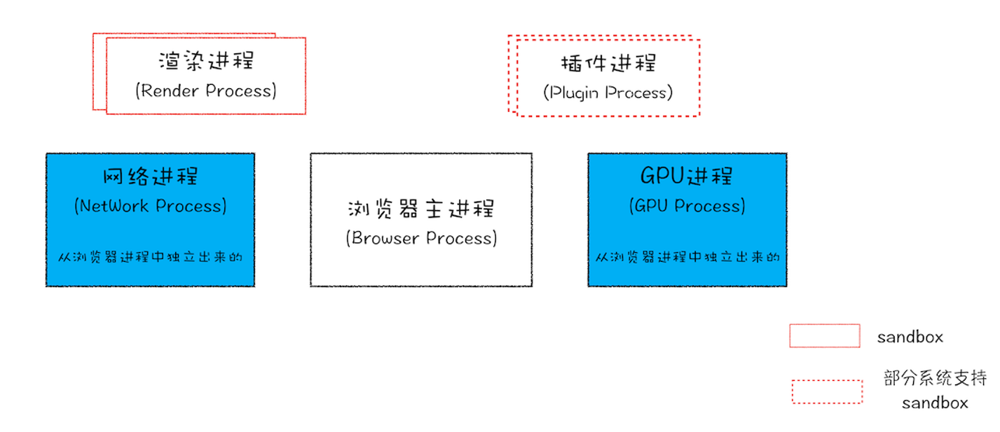

从图中可以看出，最新的 Chrome 浏览器包括：

- 1 个浏览器主进程
- 1 个 GPU 进程
- 1 个网络进程
- 多个渲染进程
- 多个插件进程

这些进程的**功能**：

- **浏览器进程**：主要负责界面显示、用户交互、子进程管理，同时提供存储等功能。
- **渲染进程**：核心任务是将 HTML、CSS 和 JavaScript 转换为用户可以与之交互的网页，排版引擎 Blink 和 JavaScript 引擎 V8 都是运行在该进程中，默认情况下，Chrome 会为每个 Tab 标签创建一个渲染进程。出于安全考虑，渲染进程都是运行在沙箱模式下。
- **GPU 进程**：其实， GPU 的使用初衷是为了实现 3D CSS 的效果，只是随后网页、Chrome 的 UI 界面都选择采用 GPU 来绘制，这使得 GPU 成为浏览器普遍的需求。最后，Chrome 在其多进程架构上也引入了 GPU 进程。
- **网络进程**：主要负责页面的网络资源加载，之前是作为一个模块运行在浏览器进程里面的，直至最近才独立出来，成为一个单独的进程。
- **插件进程**：主要是负责插件的运行，因插件易崩溃，所以需要通过插件进程来隔离，以保证插件进程崩溃不会对浏览器和页面造成影响。

所以，**打开一个网页，最少需要四个进程**：1 个网络进程、1 个浏览器进程、1 个 GPU 进程以及 1 个渲染进程。如果打开的页面有运行插件的话，还需要再加上 1 个插件进程。

虽然多进程模型提升了浏览器的稳定性、流畅性和安全性，但同样不可避免地带来了一些问题：

- **更高的资源占用**：因为每个进程都会包含公共基础结构的副本（如 JavaScript 运行环境），这就意味着浏览器会消耗更多的内存资源。
- **更复杂的体系架构**：浏览器各模块之间耦合性高、扩展性差等问题，会导致现在的架构已经很难适应新的需求了。


## 2. 进程与线程的区别

1. **根本区别**：进程是操作系统资源分配的基本单位，而线程是处理器任务调度和执行的基本单位。
2. **资源开销**：每个进程都有<u>独立</u>的代码和数据空间（程序上下文），<u>程序之间的切换会有较大的开销</u>；线程可以看作轻量级的线程，同一类线程<u>共享代码和数据空间</u>，每个线程都有自己独立的运行栈和程序计数器（PC），线程之间切换的开销小。
3. **包含关系**：如果一个进程内有多个线程，则执行过程不是一条线的，而是多条线（线程）共同完成的；线程是进程的一部分，所以线程也被称为轻权进程或者轻量级进程。
4. **内存分配**：同一进程的线程<u>共享</u>本进程的地址空间和资源，而进程之间的地址空间和资源是<u>相互独立</u>的
5. **影响关系**：一个进程崩溃后，在保护模式下不会对其他进程产生影响，但是<u>一个线程崩溃整个进程都死掉</u>。所以<u>多进程要比多线程健壮</u>。
6. **执行过程**：每个独立的进程有程序运行的入口、顺序执行序列和程序出口。但是线程不能独立执行，必须<u>依存</u>在应用程序中，由应用程序提供多个线程执行控制，两者均可并发执行 

## 3. 浏览器渲染进程的线程有哪些

### GUI 渲染线程

负责渲染浏览器页面，解析HTML、CSS，构建DOM树、构建CSSOM树、构建渲染树和绘制页面；当界面需要**重绘**或由于某种操作引发**回流**时，该线程就会执行。

注意：**GUI渲染线程和JS引擎线程是互斥的**，当JS引擎执行时GUI线程会被挂起，GUI更新会被保存在一个队列中等到JS引擎空闲时立即被执行。


### JS 引擎线程

JS引擎线程也称为JS内核，负责处理Javascript脚本程序，解析Javascript脚本，运行代码；JS引擎线程一直等待着任务队列中任务的到来，然后加以处理，一个Tab页中无论什么时候都只有一个JS引擎线程在运行JS程序；

注意：GUI渲染线程与JS引擎线程的互斥关系，所以如果JS执行的时间过长，会造成页面的渲染不连贯，导致页面渲染加载阻塞。


### 事件触发线程

**事件触发线程**属于浏览器而不是 JS 引擎，用来控制事件循环；当 JS 引擎执行代码块如 setTimeOut 时（也可是来自浏览器内核的其他线程,如<u>鼠标点击、AJAX 异步请求</u>等），<u>会将对应任务添加到事件触发线程</u>中；当对应的事件符合触发条件被触发时，该线程会把事件添加到待处理队列的队尾，等待 JS 引擎的处理；

注意：由于 JS 的单线程关系，所以这些待处理队列中的事件都得排队等待 JS 引擎处理（当 JS 引擎空闲时才会去执行）；


### 定时器触发进程

**定时器触发进程**即 setInterval 与 setTimeout 所在线程；浏览器定时计数器并不是由 JS 引擎计数的，因为 JS 引擎是单线程的，如果处于阻塞线程状态就会影响记计时的准确性；因此使用单独线程来计时并触发定时器，计时完毕后，添加到事件队列中，等待 JS 引擎空闲后执行，所以定时器中的任务在设定的时间点不一定能够准时执行，定时器只是在指定时间点将任务添加到事件队列中；

注意：W3C 在 HTML 标准中规定，定时器的定时时间不能小于 4ms，如果是小于 4ms，则默认为 4ms。


### 异步 http 请求线程

- XMLHttpRequest 连接后通过浏览器新开一个线程请求；
- 检测到状态变更时，如果设置有回调函数，异步线程就产生状态变更事件，将回调函数放入事件队列中，等待 JS 引擎空闲后执行；


## 4. 进程之间的通信方式

进程是分配系统资源的单位（包括内存地址空间），因此<u>各进程</u>拥有的<u>内存地址空间相互独立</u>。

### 管道通信

- **匿名管道通信：**管道是一种半双工的通信方式，数据只能<u>单向流动</u>，而且只能在<u>具有亲缘关系</u>的进程间使用。进程的<u>亲缘关系通常是指父子进程关系</u>。
- **高级管道通信：**将另一个程序当做一个新的进程在当前程序进程中启动，则它算是当前程序的子进程，这种方式我们成为高级管道方式。
- **有名管道通信：**有名管道也是半双工的通信方式，但是它<u>允许无亲缘关系进程间</u>的通信。


### 消息队列通信

消息队列是由消息的链表，存放在内核中并由消息队列标识符标识。消息队列克服了信号传递信息少、管道只能承载无格式字节流以及缓冲区大小受限等缺点。


### 信号量通信

信号量是一个计数器，可以用来控制多个进程对共享资源的访问。它常作为一种锁机制，防止某进程正在访问共享资源时，其他进程也访问该资源。因此，主要作为进程间以及同一进程内不同线程之间的同步手段。

### 信号通信

信号（Signals ）是Unix系统中使用的最古老的进程间通信的方法之一。操作系统<u>通过信号来通知进程系统中发生了某种预先规定好的事件</u>（一组事件中的一个），它也是用户进程之间通信和同步的一种原始机制。


### 共享内存通信

共享内存就是映射一段能被其他进程所访问的内存，这段<u>共享内存由一个进程创建，但多个进程都可以访问</u>（使多个进程可以访问同一块内存空间）。共享内存是最快的 IPC 方式，它是针对其他进程间通信方式运行效率低而专门设计的。它往往与其他通信机制，如信号量，配合使用，来实现进程间的同步和通信。


### 套接字通信

套接口也是一种进程间通信机制，与其他通信机制不同的是，它可用于不同机器间的进程通信。


## 5. 僵尸进程和孤儿进程是什么？

- **孤儿进程**：父进程退出了，而它的一个或多个子进程还在运行，那么这些子进程都会成为孤儿进程。孤儿进程将被 init 进程（进程号为1）所收养，并由 init 进程对它们完成状态收集工作。**因为孤儿进程会被 init 进程接管，所以孤儿进程是没有危害的**。

- **僵尸进程**：和孤儿进程相反的是，这次是子进程先退出，而父进程又没有去处理回收释放子进程的资源，这个时候子进程就成了僵尸进程。资源上是占用不了什么资源。但是通常系统的进程数量都是有限制的，<u>如果有大量的僵尸进程占用进程号，导致新的进程无法创建，这个**危害**类似于占个坑，不办事</u>。

  **解决方案：**

  1. **干掉父进程**，让剩下的子进程称为孤儿进程，成为孤儿进程后就和我们上面说的一样了，由 init 进程来领养这些进程，并且来处理这些进程的资源释放等工作。

  2. **父进程调用 wait 或 waitpid**，等函数等待子进程结束，这会导致父进程挂起。

     执行 wait（）或 waitpid（）系统调用，则子进程在终止后会立即把它在进程表中的数据返回给父进程，此时系统会立即删除该进入点。在这种情形下就不会产生 defunct 进程。

  3. **fork 两次**，第一次 fork : 父进程 fork 一个子进程，第二次 fork : 子进程 fork 一个孙进程后退出，那么孙进程被 init 接管，当孙进程结束后，init 会回收。但子进程的回收还要自己做。

  4. **signal 函数**，
     父进程来处理：用 signal 函数为 SIGCHLD 安装 handler，在子进程结束后，父进程会收到该信号，可以在 handler 中调用 wait 回收。

     内核来处理:

     如果父进程不关心子进程什么时候结束，可以通过以下两个函数通知内核自己不感兴趣子进程的结束，此时，子进程结束后，内核会回收并不再给你父进程发信号。

     - signal（SIGCLD, SIG_IGN）

     - signal（SIGCHLD, SIG_IGN）


## 6. 死锁产生的原因？如何解决死锁的问题？

所谓**死锁**，是指多个进程在运行过程中因争夺资源而造成的一种僵局，当进程处于这种僵持状态时，**若无外力作用**，它们都将无法再向前推进。


**系统中的资源可以分为两类**：

- **可剥夺资源**，是指某进程在获得这类资源后，该资源可以再被其他进程或系统剥夺，CPU 和主存均属于可剥夺性资源；
- **不可剥夺资源**，当系统把这类资源分配给某进程后，再不能强行收回，只能在进程用完后自行释放，如磁带机、打印机等。


**产生死锁的原因：**

1. 系统资源不足；
2. 程序执行的顺序有问题；
3. 资源分配不当等。

如果系统资源充足，进程的资源请求都能够得到满足，那么死锁出现的可能性就很低；否则，

就会因争夺有限的资源而陷入死锁。其次，程序执行的顺序与速度不同，也可能产生死锁。**产生死锁的四个必要条件**：

- 互斥条件：一个资源每次只能被一个进程使用。
- 请求与保持条件：一个进程因请求资源而阻塞时，对已获得的资源保持不放。
- 不剥夺条件：进程已获得的资源，在末使用完之前，不能强行剥夺，只能在使用完时由自己释放。
- 循环等待条件：若干进程之间形成一种头尾相接的循环等待资源关系。

这四个条件是死锁的必要条件，只要系统发生死锁，这些条件必然成立，而<u>只要上述条件之一不满足，就不会发生死锁</u>。


**预防死锁的方法：**

- **打破互斥条件：**即允许进程同时访问某些资源。但是由于某些资源不允许被同时访问，所以这种方法在实际中应用不大。
- **打破不剥夺条件：**即当某进程获得了部分资源，但得不到其它资源，则释放已占有的资源。
- **打破请求与保持条件**：可以实行资源预先分配策略。即进程在运行前一次性地向系统申请它所需要的全部资源。如果某个进程所需的全部资源得不到满足，则不分配任何资源，此进程暂不运行。只有当系统能够满足当前进程的全部资源需求时，才一次性地将所申请的资源全部分配给该进程。
- **打破循环等待条件**：实行资源有序分配策略。采用这种策略，即把资源事先分类编号，按号分配，使进程在申请，占用资源时不会形成环路。所有进程对资源的请求必须严格按资源序号递增的顺序提出。进程占用了小号资源，才能申请大号资源，就不会产生环路，从而预防了死锁。


**死锁的避免：**

死锁的避免，它不限制进程有关申请资源的命令，而是<u>对进程所发出的每一个申请资源命令加以动态地检查，并根据检查结果决定是否进行资源分配</u>。就是说，在资源分配过程中若预测有发生死锁的可能性，则加以避免。这种方法的关键是确定资源分配的安全性。


## 7. 如何实现浏览器内多个标签页之间的通信？

实现多个标签页之间的通信，**本质**上都是<u>通过中介者模式</u>来实现的。因为标签页之间没有办法直接通信，因此我们可以找一个中介者，让标签页和中介者进行通信，然后让这个中介者来进行消息的转发。通信方法如下：

- **使用 websocket 协议**，因为 websocket 协议可以实现服务器推送，所以服务器就可以用来当做这个中介者。标签页通过向服务器发送数据，然后由服务器向其他标签页推送转发。
- **使用 ShareWorker 的方式**，shareWorker 会在页面存在的生命周期内创建一个唯一的线程，并且开启多个页面（<u>但必须保证这些标签页都是同源的</u>）也只会使用同一个线程。这个时候共享线程就可以充当中介者的角色。标签页间通过共享一个线程，然后通过这个共享的线程来实现数据的交换。
- **使用 localStorage 的方式**，我们可以在一个标签页对 localStorage 的变化事件进行监听，然后当另一个标签页修改数据的时候，我们就可以通过这个监听事件来获取到数据。这个时候 localStorage 对象就是充当的中介者的角色。
- **使用 postMessage 方法**，如果我们能够获得对应标签页的引用，就可以使用postMessage 方法，进行通信。


## 8. 对 Service Worker 的理解

Service Worker 是运行在浏览器背后的**独立线程**，一般可以用来实现缓存功能。使用 Service Worker的话，传输协议必须为 **HTTPS**。因为 Service Worker 中涉及到请求拦截，所以必须使用 HTTPS 协议来保障安全。


# 三、浏览器缓存

## 1. 对浏览器的缓存机制的理解

### 缓存过程分析

浏览器与服务器通信的方式为应答模式，即是：**浏览器发起 HTTP 请求 - 服务器响应该请求**。

那么浏览器第一次向服务器发起该请求后拿到请求结果，会根据响应报文中 HTTP 头的缓存表示，决定是否缓存结果，是则将请求结果和缓存标识存入浏览器缓存中，简单的过程如下图：

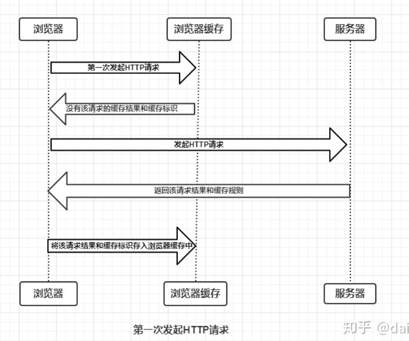

由上图我们可以知道：

- 浏览器每次发起请求，都会<u>先在浏览器缓存中查找该请求的结果以及缓存标识</u>
- 浏览器每次拿到返回的请求结果都会将该结果和缓存标识<u>存入浏览器缓存中</u>

以上两点结论就是浏览器缓存机制的关键，它确保了每个请求的缓存存入与读取。

### 强制缓存

**强制缓存就是向浏览器缓存查找该请求结果，并根据结果的缓存规则来决定是否使用该缓存结果的过程**，强制缓存的情况主要有三种，如下：

- 不存在该缓存结果和缓存标识、强制缓存失效，则直接向服务器发起请求（跟第一次发起请求过程一致），如下图：

  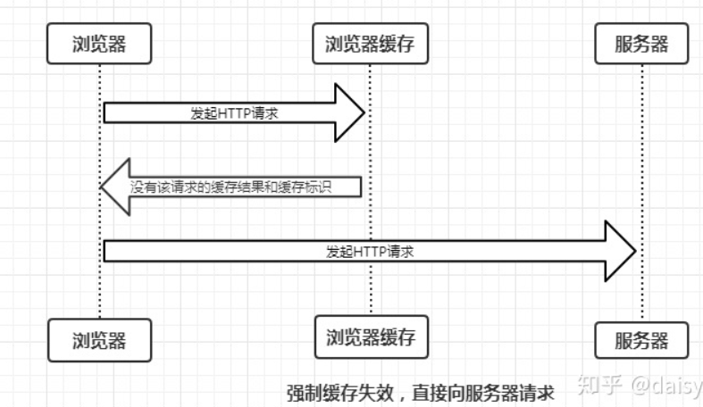

- 存在该缓存结果和缓存标识，但该结果已失效，强制缓存失效，则使用协商缓存，如下：

  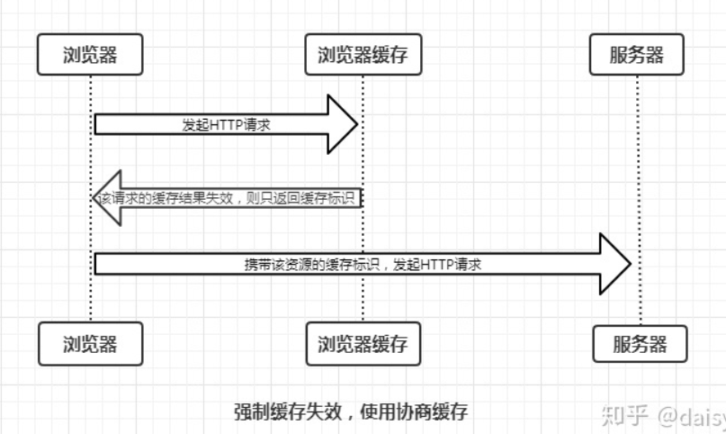

- 存在该缓存结果和缓存标识，且该结果尚未失效，强制缓存失效，直接返回该结果，如下图：

  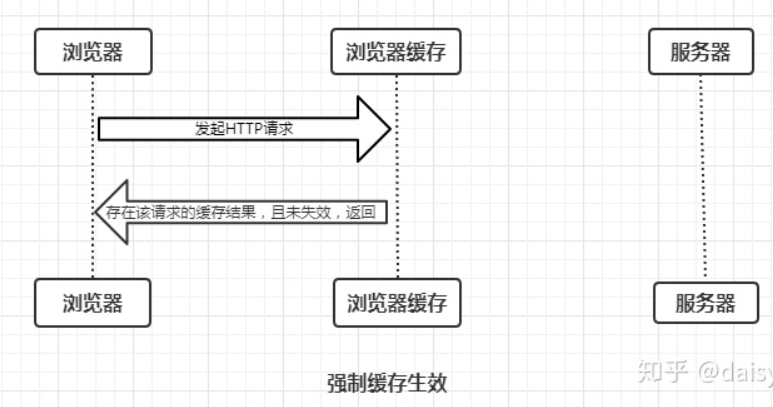

> 那么强制缓存的缓存规则是什么？

当浏览器向服务器发起请求时，服务器会将缓存规则放入 http 响应报文的 http 头中和请求结果一起返回给浏览器，控制强制缓存的字段分别是 Expires 和 Cache-Control，其中 Cache-Control 优先级比 Expires 高。

- **Expires**

  - 它是 http/1.0 控制网页缓存的字段，其值为服务器返回该请求结果缓存的到期时间，即再次发起该请求时，如果客户端的时间小于 Expires 的值时，直接使用缓存结果。

  - > Expires 是 http/1.0 的字段，但是现在浏览器默认使用 http/1.1，那么在 http/1.1 中网页还是否由 Expires 控制？

    到了 HTTP/1.1，Expire 已经被 Cache-Control 替代，**原因**在于Expires 控制缓存的**原理**<u>是使用客户端的时间与服务端返回的时间做对比，那么如果客户端与服务端的时间因为某些原因（例如时区不同；客户端和服务端有一方的时间不准确）发生误差</u>，那么强制缓存则会直接失效，这样的话强制缓存的存在则毫无意义

- **Cache-Control**

  - 在 HTTP/1.1中，Cache-Control 是最重要的规则，主要用于**控制网页缓存**，主要取值为：

    - **public**：所有内容都将被缓存（客户端和代理服务器都可缓存）
    - **private**：所有内容只有客户端可以缓存，**Cache-Control的默认取值**
    - **no-cache**：客户端缓存内容，但是是否使用缓存则需要经过协商缓存来验证决定
    - **no-store**：所有内容都不会被缓存，即不使用强制缓存，也不使用协商缓存
    - **max-age=xxx (xxx is numeric)**：缓存内容将在xxx秒后失效

  - 接下来，看一个例子，如下：

    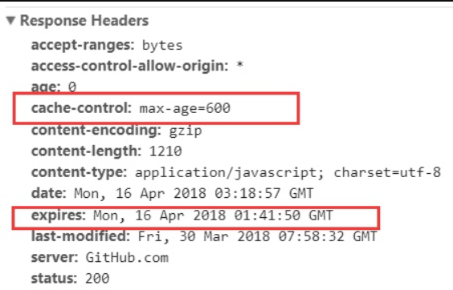

    由上面的例子我们可以知道：

    - HTTP响应报文中 expires 的时间值，是一个**绝对值**
    - HTTP响应报文中 Cache-Control 为 max-age=600，是**相对值**

    由于 Cache-Control 的**优先级**比 expires，那么直接根据 Cache-Control 的值进行缓存，意思就是说在600秒内再次发起该请求，则会直接使用缓存结果，强制缓存生效。

    注：在无法确定客户端的时间是否与服务端的时间同步的情况下，Cache-Control 相比于 expires 是更好的选择，所以<u>同时存在时，只有 Cache-Control 生效</u>。

**思考**

> 浏览器的缓存存放在哪里，如何在浏览器中判断强制缓存是否生效？

**存放位置**

1. **from memory cache** 代表使用内存中的缓存，内存缓存具有两个特点，分别是快速读取和时效性：
   1. **快速读取**：内存缓存会将编译解析后的文件，直接存入该进程的内存中，占据该进程一定的内存资源，以方便下次运行使用时的快速读取。
   2. **时效性**：一旦该进程关闭，则该进程的内存则会清空。
2. **from disk cache** 代表使用硬盘中的缓存，硬盘缓存则是直接将缓存写入硬盘文件中，读取缓存需要对该缓存存放的硬盘文件进行I/O操作，然后重新解析该缓存内容，读取复杂，速度比内存缓存慢。

浏览器**读取缓存的顺序**为 memory --> disk

> 为啥请求缓存的位置既有内存又有硬盘？👇

在浏览器中，浏览器会在js和图片等文件解析执行后直接存入内存缓存中，那么当刷新页面时只需直接从内存缓存中读取(from memory cache)；而css文件则会存入硬盘文件中，所以每次渲染页面都需要从硬盘读取缓存(from disk cache)。


### 协商缓存

**协商缓存就是强制缓存失效后，浏览器携带缓存标识向服务器发起请求，由服务器根据缓存标识决定是否使用缓存的过程**，主要有以下两种情况：

- 协商缓存生效，返回 304，如下：

  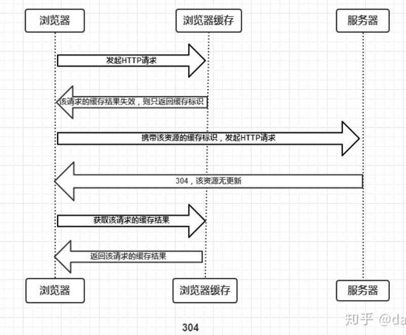

- 协商缓存失效，返回200和请求结果结果，如下

  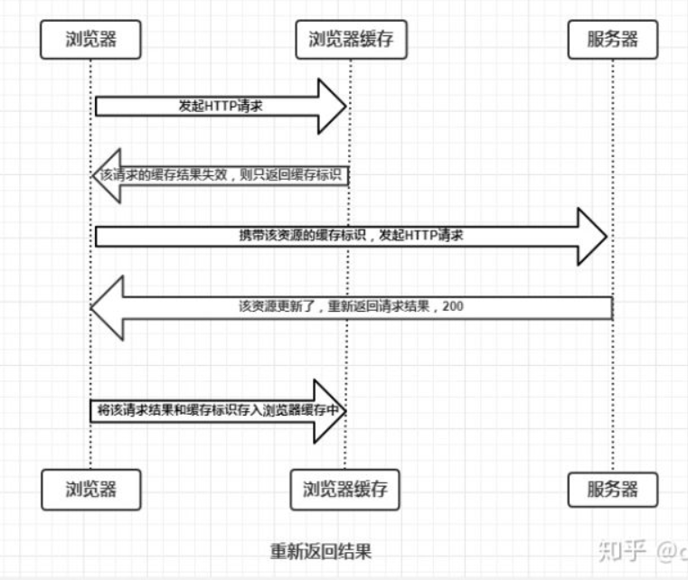

同样，协商缓存的标识也是在响应报文的 HTTP 头中和请求结果一起返回给浏览器的，控制协商缓存的字段分别有：**Last-Modified / If-Modified-Since 和 Etag / If-None-Match**，其中 **Etag / If-None-Match 的优先级比Last-Modified / If-Modified-Since 高**。

- **Last-Modified** 是服务器响应请求时，返回<u>该资源文件在服务器最后被修改的时间</u>，`last-modified: wed, 21 Mar 201800:37:57 GMT`
- **If-Modified-Since** 则是<u>**客户端**再次发起该请求时，**携带**上次请求返回的Last-Modified 值</u>，通过此字段值告诉服务器该资源上次请求返回的最后被修改时间。服务器收到该请求，发现请求头含有 If-Modified-Since 字段，则会根据 If-Modified-Since的 字段值与该资源在服务器的最后被修改时间做对比，若服务器的资源最后被修改时间大于 If-Modified-Since的字段值，则重新返回资源，状态码为200；否则则返回304，代表资源无更新，可继续使用缓存文件。`if-modified-since: wed,21 Mar 201800:37:57GMT`
- **Etag**，是服务器响应请求时，返回当前资源文件的一个唯一标识(由服务器生成)，如 `etag: W/ "175737-1521592677000"`
- **If-None-Match** 是<u>**客户端**再次发起该请求时，携带上次请求返回的唯一标识 Etag 值</u>，通过此字段值告诉服务器该资源上次请求返回的唯一标识值。服务器收到该请求后，发现该请求头中含有 If-None-Match，则会根据 If-None-Match 的字段值与该资源在服务器的 Etag 值做对比，一致则返回304，代表资源无更新，继续使用缓存文件；不一致则重新返回资源文件，状态码为200，如：`if-none-match: W/ "175737-1521592677000"`
- **注**：Etag / If-None-Match 优先级高于 Last-Modified / If-Modified-Since，同时存在则只有 Etag / If-None-Match生效。


### 小结

**强制缓存优先于协商缓存进行**，若强制缓存(Expires和Cache-Control)生效则直接使用缓存，若不生效则进行协商缓存(Last-Modified / If-Modified-Since和Etag / If-None-Match)，协商缓存由服务器决定是否使用缓存，若协商缓存失效，那么代表该请求的缓存失效，重新获取请求结果，再存入浏览器缓存中；生效则返回304，继续使用缓存，主要过程如下：

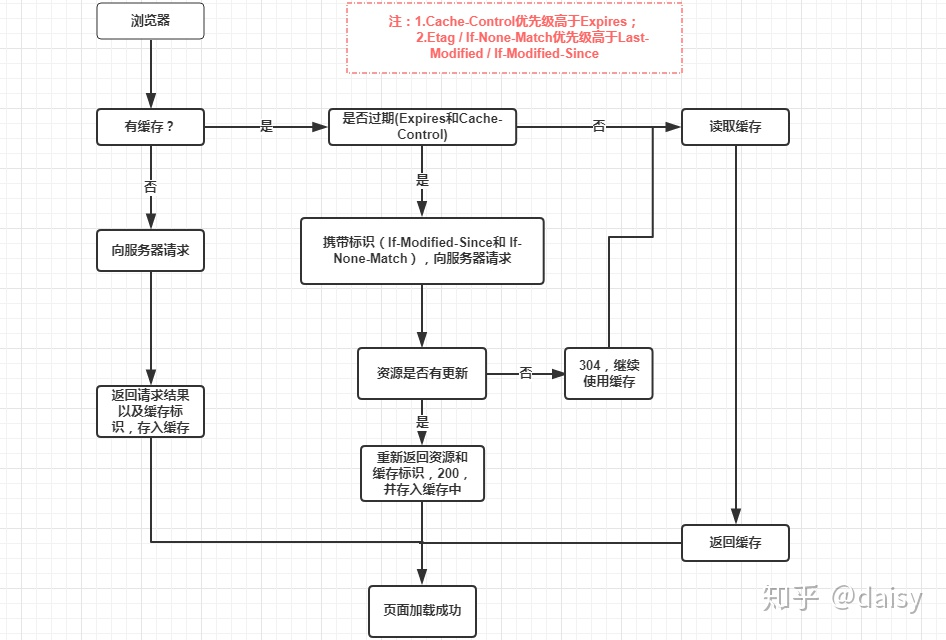

参考文章：

[彻底理解浏览器的缓存机制](https://zhuanlan.zhihu.com/p/53507705)


## 2. 浏览器的缓存位置

从缓存位置上来说分为四种，并且各自有优先级，当依次查找缓存且都没有命中的时候，才会去请求网络。

- Service Worker
- Memory Cache
- Disk Cache
- Push Cache

### 1.Service Worker

Service Worker 是运行在浏览器背后的独立线程，一般可以用来实现缓存功能。使用 Service Worker的话，传输协议必须为 HTTPS。因为 Service Worker 中涉及到请求拦截，所以必须使用 HTTPS 协议来保障安全。**Service Worker 的缓存与浏览器其他内建的缓存机制不同，它可以让我们自由控制缓存哪些文件、如何匹配缓存、如何读取缓存，并且缓存是持续性的**。

Service Worker 实现缓存功能一般分为三个步骤：首先需要先注册 Service Worker，然后监听到 install 事件以后就可以缓存需要的文件，那么在下次用户访问的时候就可以通过拦截请求的方式查询是否存在缓存，存在缓存的话就可以直接读取缓存文件，否则就去请求数据。

当 Service Worker 没有命中缓存的时候，我们需要去调用 fetch 函数获取数据。也就是说，如果我们没有在 Service Worker 命中缓存的话，会根据缓存查找优先级去查找数据。但是不管我们是从 Memory Cache 中还是从网络请求中获取的数据，浏览器都会显示我们是从 Service Worker 中获取的内容。

### 2.Memory Cache

Memory Cache 也就是内存中的缓存，主要包含的是当前中页面中已经抓取到的资源,例如页面上已经下载的样式、脚本、图片等。读取内存中的数据肯定比磁盘快,内存缓存虽然读取高效，可是缓存持续性很短，会随着进程的释放而释放。 **一旦我们关闭 Tab 页面，内存中的缓存也就被释放了**。

**那么既然内存缓存这么高效，我们是不是能让数据都存放在内存中呢？**
这是不可能的。计算机中的内存一定比硬盘容量小得多，操作系统需要精打细算内存的使用，所以能让我们使用的内存必然不多。

当我们访问过页面以后，再次刷新页面，可以发现很多数据都来自于内存缓存

内存缓存中有一块重要的缓存资源是preloader相关指令（例如`<link rel="prefetch">`）下载的资源。总所周知preloader的相关指令已经是页面优化的常见手段之一，它可以一边解析js/css文件，一边网络请求下一个资源。

需要注意的事情是，**内存缓存在缓存资源时并不关心返回资源的HTTP缓存头Cache-Control是什么值，同时资源的匹配也并非仅仅是对URL做匹配，还可能会对Content-Type，CORS等其他特征做校验**。

### 3.Disk Cache

Disk Cache 也就是存储在硬盘中的缓存，读取速度慢点，但是什么都能存储到磁盘中，**比之 Memory Cache 胜在容量和存储时效性上**。

在所有浏览器缓存中，Disk Cache 覆盖面基本是最大的。它会根据 HTTP Herder 中的字段判断哪些资源需要缓存，哪些资源可以不请求直接使用，哪些资源已经过期需要重新请求。并且即使在跨站点的情况下，相同地址的资源一旦被硬盘缓存下来，就不会再次去请求数据。绝大部分的缓存都来自 Disk Cache，关于 HTTP 的协议头中的缓存字段，我们会在下文进行详细介绍。

**浏览器会把哪些文件丢进内存中？哪些丢进硬盘中？**

- 对于大文件来说，大概率是不存储在内存中的，反之优先
- 当前系统内存使用率高的话，文件优先存储进硬盘

### 4.Push Cache

Push Cache（推送缓存）是 HTTP/2 中的内容，当以上三种缓存都没有命中时，它才会被使用。**它只在会话（Session）中存在，一旦会话结束就被释放，并且缓存时间也很短暂**，在Chrome浏览器中只有5分钟左右，同时它也并非严格执行HTTP头中的缓存指令。

Push Cache 在国内能够查到的资料很少，也是因为 HTTP/2 在国内不够普及。这里推荐阅读`Jake Archibald`的 [HTTP/2 push is tougher than I thought](https://links.jianshu.com/go?to=https%3A%2F%2Fjakearchibald.com%2F2017%2Fh2-push-tougher-than-i-thought%2F) 这篇文章，文章中的几个结论：

- 所有的资源都能被推送，并且能够被缓存,但是 Edge 和 Safari 浏览器支持相对比较差
- 可以推送 no-cache 和 no-store 的资源
- 一旦连接被关闭，Push Cache 就被释放
- 多个页面可以使用同一个HTTP/2的连接，也就可以使用同一个Push Cache。这主要还是依赖浏览器的实现而定，出于对性能的考虑，有的浏览器会对相同域名但不同的tab标签使用同一个HTTP连接。
- Push Cache 中的缓存只能被使用一次
- 浏览器可以拒绝接受已经存在的资源推送
- 你可以给其他域名推送资源


如果以上四种缓存都没有命中的话，那么只能发起请求来获取资源了。

那么为了性能上的考虑，大部分的接口都应该选择好缓存策略，**通常浏览器缓存策略分为两种：强缓存和协商缓存，并且缓存策略都是通过设置 HTTP Header 来实现的**。


## 3. 为什么需要浏览器缓存

对于浏览器的缓存，**主要针对的是前端的静态资源**，最好的效果就是，在发起请求之后，拉取相应的静态资源，并保存在本地。如果服务器的静态资源没有更新，那么在下次请求的时候，就直接从本地读取即可，如果服务器的静态资源已经更新，那么我们再次请求的时候，就到服务器拉取新的资源，并保存在本地。**这样就大大的减少了请求的次数，提高了网站的性能**。这就要用到浏览器的缓存策略了。


所谓的**浏览器缓存**指的是浏览器将用户请求过的静态资源，存储到电脑本地磁盘中，当浏览器再次访问时，就可以直接从本地加载，不需要再去服务端请求了。


使用浏览器缓存，有以下优点：

- 减少了服务器的负担，提高了网站的性能
- 加快了客户端网页的加载速度
- 减少了多余网络数据传输（减少 http 请求）


## 4. 点击刷新按钮或者 F5、按 Ctrl + F5（强制刷新）、地址栏回车有什么区别？

- **点击刷新按钮或者按 F5：**浏览器直接对本地的缓存文件过期，但是会带上If-Modifed-Since，If-None-Match，这就意味着服务器会对文件检查新鲜度，返回结果可能是 304，也有可能是 200。
- **用户按 Ctrl+F5（强制刷新）：**浏览器不仅会对本地文件过期，而且不会带上 If-Modifed-Since，If-None-Match，相当于之前从来没有请求过，返回结果是 200。
- **地址栏回车**： 浏览器发起请求，按照正常流程，本地检查是否过期，然后服务器检查新鲜度，最后返回内容。


# 四、浏览器组成

### 1. 对浏览器的理解

浏览器的主要功能是将用户选择的 web 资源呈现出来，它需要从服务器请求资源，并将其显示在浏览器窗口中，资源的格式通常是 HTML，也包括 PDF、image 及其他格式。用户用 URI（Uniform Resource Identifier 统一资源标识符）来指定所请求资源的位置。


HTML 和 CSS 规范中规定了浏览器解释 html 文档的方式，由 W3C 组织对这些规范进行维护，W3C 是负责制定 web 标准的组织。但是浏览器厂商纷纷开发自己的扩展，对规范的遵循并不完善，这为 web 开发者带来了严重的兼容性问题。


浏览器可以分为两部分，shell 和 内核。其中 shell 的种类相对比较多，内核则比较少。也有一些浏览器并不区分外壳和内核。从 Mozilla 将 Gecko 独立出来后，才有了外壳和内核的明确划分。

- shell 是指浏览器的外壳：例如菜单，工具栏等。主要是提供给用户界面操作，参数设置等等。它是调用内核来实现各种功能的。
- 内核是浏览器的核心。内核是基于标记语言显示内容的程序或模块。


### 2. 对浏览器内核的理解

浏览器内核主要分成两部分：

- **渲染引擎**的职责就是渲染，即在浏览器窗口中显示所请求的内容。默认情况下，渲染引擎可以显示 html、xml 文档及图片，它也可以借助插件显示其他类型数据，例如使用 PDF 阅读器插件，可以显示 PDF 格式。
- **JS 引擎**：解析和执行 javascript 来实现网页的动态效果。

最开始渲染引擎和 JS 引擎并没有区分的很明确，后来 JS 引擎越来越独立，内核就倾向于只指渲染引擎。


# 五、浏览器渲染原理

## 1. 浏览器的渲染过程

1. **解析 HTML 文件，创建 DOM 树**

   浏览器<u>解析 html 源码</u>，然后<u>创建一个 DOM 树</u>。<u>并行请求 css/image/js</u> 在 DOM 树中，每一个 HTML 标签都有一个对应的节点，并且每一个文本也都会有一个对应的文本节点。DOM 树的根节点就是 documentElement，对应的是 html 标签。
   
   > **构建 DOM 树的具体步骤**：
   >
   > 1. **转码**（Bytes --> characters）：读取接收到的 HTML 二进制数据，按指定编码格式将字节转换为 html 字符串。
   > 2. **Token 化**（characters --> Tokens）：解析 HTML。将 HTML 字符串转换为结构清晰的 Tokens，每个 Tokens 都有特殊的含义同时有自己的一套规则。（词法分析）
   > 3. **构建 Nodes**（Tokens --> Nodes）：每个 Node 都有添加特定的属性（或属性访问器），通过指针确定 Node 的父、子、兄弟和所属的 treeScope（例如：iframe 的 treeScope 与外层的 treeScope 不同）。
   > 4. **构建 DOM 树**（Nodes --> Dom Tree）：建立起每个节点的父子兄关系。
   
2. **解析 CSS，形成 CSS 对象模型**

   浏览器解析 CSS 代码，计算出最终的样式数据，构建 CSSOM 树。对 CSS 代码中的非法的语法它会直接忽略掉。解析 CSS 的时候会按照如下顺序来定义优先级：
   浏览器默认设置 < 用户设置 < 外链设置 < 内联样式 < html 中的 style

3. **将 CSS 与 DOM 合并，构建渲染树（rendering tree）**

   DOM Tree + CSSOM -> 渲染树（rendering tree）。渲染树和 DOM 树有点像，但是有区别。DOM 树完全和 html 标签一一对应，但是渲染树<u>会忽略掉不需要渲染的元素</u>，比如 head、display:none 的元素等。而且一大段文本中的每一个行在渲染树中都是独立的一个节点。渲染树中的每一个节点都存储有对应的 css 属性。

4. **布局与绘制**

   一旦渲染树创建好了，浏览器就可以<u>**根据渲染树**直接把页面**布局并绘制**到屏幕上</u>。
   **布局阶段**浏览器要做的事情是要弄清楚各个节点在页面中的确切位置和大小。通常这一行为也被称为“**自动重排**”。
   布局阶段结束后是**绘制阶段**，遍历渲染树并调用渲染对象的 paint 方法将它们的内容显示在屏幕上，绘制使用 UI 基础组件。

   ****

   以上四个步骤并不是一次性顺序完成的。如果 DOM 或者 CSSOM 被修改，以上过程会被重复执行。实际上，CSS 和 JavaScript 往往会多次修改 DOM 或者 CSSOM 。

   > **Repaint(重绘)**
   > 重绘是改变不影响元素在网页中的位置的元素样式时，譬如background-color(背景色)， border-color(边框色)， visibility(可见性)，浏览器会根据元素的新属性重新绘制一次(这就是重绘，或者说重新构造样式)，<u>使元素呈现新的外观</u>。**重绘不会带来重新布局，所以并不一定伴随重排。**
   > **Reflow（重排）**
   > 渲染对象在创建完成并添加到渲染树时，并不包含位置和大小信息。计算这些值的过程称为布局或重排。

   "重绘"不一定需要"重排"，比如改变某个网页元素的颜色，就只会触发"重绘"，不会触发"重排"，因为布局没有改变。
   但是，"重排"必然导致"重绘"，比如改变一个网页元素的位置，就会同时触发"重排"和"重绘"，因为布局改变了。

   > 引出问题：**浏览器如何优化渲染？**
   >
   > （1）将多次改变样式属性的操作合并成一次操作
   >
   > （2）将需要多次重排的元素，position 属性设为 absolute 或 fixed，这样此元素就脱离了文档流，它的变化<u>不会影响到其他元素</u>。例如有动画效果的元素就最好设置为绝对定位。
   >
   > （3）由于 display 属性为 none 的元素不在渲染树中，对隐藏的元素操作不会引发其他元素的重排。如果要对一个元素进行复杂的操作时，<u>可以先隐藏它，操作完成后再显示</u>。这样只在隐藏和显示时触发2次重排。


大致过程如图所示：

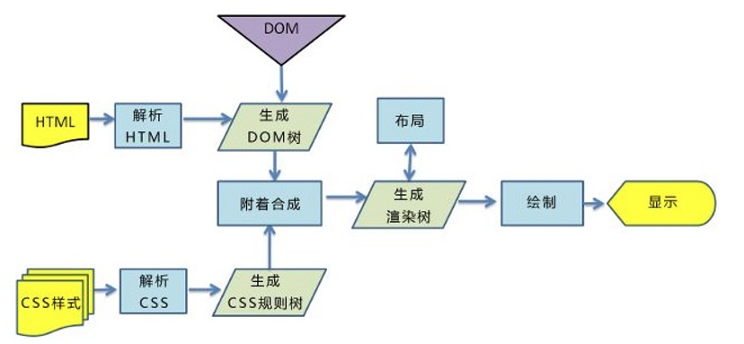

**注意：**这个过程是逐步完成的，**为了更好的用户体验**，渲染引擎将会<u>尽可能早</u>的将内容呈现到屏幕上，并不会等到所有的 html 都解析完成之后再去构建和布局 render 树。它是解析完一部分内容就显示一部分内容，同时，可能还在通过网络下载其余内容。


## 2. 浏览器渲染优化

1. 多个 DOM 的读操作（或者多个写操作），应该放在一起，不要两个读操作之间加入一个写操作（**合并 DOM 操作**）。
2. 如果某个属性/元素是通过重排计算得到的，那么最好缓存结果。避免下一次用到的时候，浏览器又要重排（**缓存 DOM 查询操作结果**）。
3. 不要一条一条改变样式，而要通过改变 class，或者 csstest 属性，**一次性地改变样式**。
4. 尽量使用离线 DOM，而不是真实的网页 DOM，来改变元素样式。比如，**操作 Document Fragment 对象**，完成后再把这个对象加入 DOM。再比如，使用 cloneNode() 方法，**在克隆的节点上进行操作**，然后再用克隆的节点替换原始节点。
5. **先将元素设为 display:none** （需要一次重排和重绘），然后对这个节点进行100次操作，**最后再恢复显示**（需要一次重排和重绘）。这样一来，你就用两次重新渲染，取代了可能高达100次的重新渲染。
6. **position 属性为 absolute 或 fixed 的元素**，重排的开销会比较小，因为不用考虑它对其他元素的影响。
7. 只在必要的时候，才将元素的 display 属性设为可见，因为**不可见的元素不影响重排和重绘**。另外，visibility:hidden 的元素只对重绘有影响，不影响重排。
8. **使用虚拟 DOM 的脚本库**，比如 React 等。
9. 使用 window.requestAnimationFrame()、window.requestIdleCallback() 这两个方法调节重新渲染。
10. css 在 head 前，js 在 body 后。


## 3. 渲染过程中遇到了 js 文件如何处理？

JavaScript 的加载、解析与执行**会阻塞文档的解析**，也就是说，在构造 DOM时，HTML 解析器若是遇到了 JavaScript，那么它会暂停文档的解析，将控制权交给 JavaScript 引擎，等 JavaScript 引擎运行完毕，浏览器再从中断的地方恢复继续解析文档。

也就是说，如果我们想首屏渲染的越快，就越不应该在首屏就加载 js 文件，这也是**建议将 script 标签放在 body 标签底部**的原因。当然，并不说 script标签必需放在底部，因为**可以给 script 标签添加 defer 或者 async 属性**。

**defer 与 async 的异同**：

- 相同：异步加载脚本
- 不同
  - async 加载完毕后立即执行，defer 加载完毕后延迟到 DOM 解析完再执行，会在事件 DomContentLoaded 之前
  - async 的顺序不定，defer 的顺序稳定


## 4. 什么是文档的预解析

Webkit 和 Firefox 都做了这个优化，当执行 JavaScript 脚本时，**预加载扫描器**解析剩下的文档，并加载后面需要通过网络加载的资源。这种方式可以使资源并行加载从而使整体速度更快。需要注意的是，预解析并不改变 DOM 树，它将这个工作留给主解析过程，自己**只解析外部资源的引用**，比如外部脚本、样式表及图片。

**总结：预加载扫描器提前下载 html 页面上声明的脚本**


## 5. CSS 如何阻塞文档解析？

基于性能与用户体验的考虑，浏览器会尽量减少渲染的次数，**故 css 会阻塞页面渲染，但不会阻塞文档解析**。但是如果 js 脚本放在 link 后面的话，浏览器避免脚本想要获取样式而获取不到的情况，会先等待前面的所有样式下载完后，再执行 js 脚本，其中 js 又会阻塞文档解析。


## 6. 如何优化关键渲染路径？

优化关键渲染路径是指优先显示与当前用户操作有关的内容。

为尽快完成首次渲染，我们需要最大限度减少以下三种可变因素：

1. 关键资源的数量
2. 关键路径的长度
3. 关键字节的数量

**关键资源**是可能阻止网页首次渲染的资源。这些资源越少，浏览器的工作量就越小，对 CPU 以及其他资源的占用也就越少。
**关键路径**的长度指的是<u>浏览器和资源服务器之间的往返次数</u>（Round-Trip Time），通常被称作 RTT。
**关键字节**的数量指的是关键资源的字节大小，浏览器要下载的资源字节越小，则下载速度与处理资源的速度都会更快。通常很多优化方法都是针对关键字节的数量进行优化。例如：压缩。

> 关键路径中的每一步耗时越长，由于阻塞会导致渲染路径的整体耗时变长。

**优化关键渲染路径的常规步骤如下: **

1. 对关键路径进行分析和特性描述: 资源数、字节数、长度。
2. 最大限度减少关键资源的数量: 删除它们，延迟它们的下载，将它们标记为异步等。
3. 优化关键字节数以缩短下载时间（往返次数）。
4. 优化其余关键资源的加载顺序: 您需要尽早下载所有关键资产，以缩短关键路径长度。


**具体操作**

1. **优化 DOM**，本质上，优化DOM其实是在**尽可能的减小关键路径的长度与关键字节的数量**。
   1. 缩小文件的尺寸（删除注释、空格与换行等无用的文本）
   2. 使用 gzip 压缩
   3. 使用缓存（HTTP Cache）
2. **优化 CSSOM**
   1. 缩小文件尺寸、使用 gzip 压缩、使用 http 缓存
   2. css 资源在构建渲染树时，会阻塞 JavaScript，所以我们应该保<u>证所有与首屏渲染无关的 css 资源都应该被标记为**非关键资源**</u>。
   3. 避免使用 @import 是为了降低关键路径的长度。
3. **异步 JavaScript**
   1. 缩小文件尺寸、使用 gzip 压缩、使用 http 缓存
   2. 可以为 script 标签添加 async 属性，减少关键资源的数量

[参考文章](https://github.com/berwin/Blog/issues/32)


## 7. 什么情况会阻塞渲染？

**首先渲染的前提是生成渲染树，所以 HTML 和 CSS 肯定会阻塞渲染。**如果你想渲染的越快，你越应该降低一开始需要渲染的文件大小，并且扁平层级，优化选择器。然后当浏览器在解析到 script 标签时，会暂停构建 DOM，完成后才会从暂停的地方重新开始。也就是说，**如果你想首屏渲染的越快，就越不应该在首屏就加载 JS 文件**，这也是都建议将 script 标签放在 body 标签底部的原因。


当然在当下，并不是说 script 标签必须放在底部，因为你可以给 script 标签添加 defer 或者 async 属性。当 script 标签加上 defer 属性以后，表示该 JS 文件会并行下载，但是会放到 HTML 解析完成后顺序执行，所以对于这种情况你可以把 script 标签放在任意位置。对于没有任何依赖的 JS 文件可以加上 async 属性，表示 JS 文件下载不会阻塞渲染。


# 六、浏览器本地存储

## 1. 浏览器本地存储方式及使用场景

### cookie

- 本身用于<u>浏览器和 server 通讯</u>
- 被“**借用**”到本地存储来
- 可用 document.cookie = '...' 来修改
- **缺点**
  - 存储大小，最大 4KB
  - http 请求时需要发送到服务端，增加请求数据量
  - 只能用 document.cookie = ‘...' 来修改，太过简陋


### localStorage 和 seesionStorage

- **优点**
  - HTML5 专门为存储而设计，最大可存 5M
  - API 简单易用 setItem getItem
  - 不会随着 http 请求被发送出去
- **区别**
  - localStorage 数据会永久存储，除非代码或手动删除
  - sessionStroage 数据只存在于当前会话，浏览器关闭则清空
  - 一般用 localStorage 会更多一些


### 描述 cookie localStorage sessionStorage 区别

- 容量
  - cookie 有 4KB，localStorage 和 seesionStorage 有 5M
- API 易用性，后两者相对简单
- 是否跟随 http 请求发送出去
  - cookie 跟随，其他不跟随


## 2. cookie 有哪些字段，作用分别是什么

**cookie 由以下字段组成：**

- name：cookie 的名称
- value：cookie 的值
- size：cookie 的大小
- path：可以访问此 cookie 的页面路径
- secure：指定是否使用 https 安全协议发送 cookie
- domain：可以访问该 cookie 的域名，Cookie 机制并未遵循严格的同源策略，允许一个子域可以设置或获取其父域的 Cookie。
- http：字段 cookie 的 httponly 属性。若此属性为 true，则只有在 http请求头中会带有此 cookie 的信息，而不能通过 document.cookie 来访问此 cookie。
- expires / max-size：此 cookie 的超时时间。
- same-site:用来限制第三方 Cookie，从而减少安全风险(CSRF)。可以设置三个值strict,lax,none
  - strict：完全禁止第三方cookie。只有当前URL与请求目标一致才会带上cookie
  - lax：大多数情况不发送第三方cookie，但是`<a href>`，`<link rel="prerender">`,get请求的表单这三种会发送cookie(post的表单是不发送cookie的)
  - none：显示关闭same-site属性。前提是必须同时设置Secure属性（Cookie只能通过HTTPS协议发送）

**总结：**

服务器端可以使用 Set-Cookie 的响应头部来配置 cookie 信息。一条cookie 包括了5个属性值 expires、domain、path、secure、HttpOnly。其中 expires 指定了 cookie 失效的时间，domain 是域名、path是路径，domain 和 path 一起限制了 cookie 能够被哪些 url 访问。secure 规定了 cookie 只能在确保安全的情况下传输，HttpOnly 规定了这个 cookie 只能被服务器访问，不能使用 js 脚本访问。


## 3. 前端存储的方式有哪些？

- **cookies**： 在HTML5标准前本地储存的主要⽅式，**优点**是兼容性好，请求头⾃带cookie⽅便，**缺点**是⼤⼩只有4k，<u>⾃动请求头加⼊cookie浪费流量</u>，每个domain限制20个cookie，使⽤起来麻烦，需要⾃⾏封装；
- **localStorage**：HTML5加⼊的以键值对(Key-Value)为标准的⽅式，优点是操作⽅便，永久性储存（除⾮⼿动删除），⼤⼩为5M，兼容IE8+ ；
- **sessionStorage**：与localStorage基本类似，区别是sessionStorage当⻚⾯关闭后会被清理，⽽且与cookie、localStorage不同，他不能在所有同源窗⼝中共享，是会话级别的储存⽅式； 
- **Web SQL**：2010年被W3C废弃的本地数据库数据存储⽅案，但是主流浏览器（⽕狐除外）都已经有了相关的实现，web sql类似于SQLite，是真正意义上的关系型数据库，⽤sql进⾏操作，当我们⽤JavaScript时要进⾏转换，较为繁琐； 
- **IndexedDB**： 是被正式纳⼊HTML5标准的数据库储存⽅案，它是NoSQL数据库，⽤键值对进⾏储存，可以进⾏快速读取操作，⾮常适合web场景，同时⽤JavaScript进⾏操作会⾮常便。 


## 4. indexDB 有哪些特点？

IndexedDB是一种在浏览器端存储数据的方式。既然称之为DB，是因为它丰富了客户端的查询方式，并且因为是本地存储，可以有效的减少网络对页面数据的影响。

有了IndexedDB，浏览器可以存储更多的数据，从而丰富了浏览器端的应用类型。

**（1）键值对储存。** IndexedDB 内部采用对象仓库（object store）存放数据。所有类型的数据都可以直接存入，包括 JavaScript 对象。对象仓库中，数据以"键值对"的形式保存，每一个数据记录都有对应的主键，主键是独一无二的，不能有重复，否则会抛出一个错误。

**（2）异步。** IndexedDB 操作时不会锁死浏览器，用户依然可以进行其他操作，这与 LocalStorage 形成对比，后者的操作是同步的。异步设计是为了防止大量数据的读写，拖慢网页的表现。

**（3）支持事务。** IndexedDB 支持事务（transaction），这意味着一系列操作步骤之中，只要有一步失败，整个事务就都取消，数据库回滚到事务发生之前的状态，不存在只改写一部分数据的情况。

**（4）同源限制** IndexedDB 受到同源限制，每一个数据库对应创建它的域名。网页只能访问自身域名下的数据库，而不能访问跨域的数据库。

**（5）储存空间大** IndexedDB 的储存空间比 LocalStorage 大得多，一般来说不少于 250MB，甚至没有上限。

**（6）支持二进制储存。** IndexedDB 不仅可以储存字符串，还可以储存二进制数据（ArrayBuffer 对象和 Blob 对象）。


# 七、浏览器同源策略

## 1. 什么是同略策略

跨域问题其实就是浏览器的同源策略造成的。

> 同源策略限制了从同一个源加载的文档或脚本如何与另一个源的资源进行交互。这是浏览器的一个用于隔离潜在恶意文件的重要的安全机制。同源指的是：**协议**、**端口号**、**域名**必须一致，<u>即便两个不同的域名指向同一个ip地址，也非同源</u>。

**同源政策主要限制了三个方面：**

- 当前域下的 js 脚本不能够访问其他域下的 cookie、localStorage 和 indexDB。
- 当前域下的 js 脚本不能够操作访问操作其他域下的 DOM。
- 当前域下 ajax 无法发送跨域请求。

同源政策的目的主要是为了保证用户的信息安全，它<u>只是对 js 脚本的一种限制，并不是对浏览器的限制</u>，**对于一般的 img、script、link 脚本请求都不会有跨域的限制**，这是因为这些操作都不会通过响应结果来进行可能出现安全问题的操作。


特别说明两点：

**第一：如果是协议和端口造成的跨域问题“前台”是无能为力的。**

**第二：在跨域问题上，仅仅是通过“URL的首部”来识别而不会根据域名对应的IP地址是否相同来判断。“URL的首部”可以理解为“协议, 域名和端口必须匹配”**。

这里你或许有个疑问：**请求跨域了，那么请求到底发出去没有？**

**跨域并不是请求发不出去，请求能发出去，服务端能收到请求并正常返回结果，只是结果被浏览器拦截了**。你可能会疑问明明通过表单的方式可以发起跨域请求，为什么 Ajax 就不会?因为归根结底，跨域是为了阻止用户读取到另一个域名下的内容，Ajax 可以获取响应，浏览器认为这不安全，所以拦截了响应。但是表单并不会获取新的内容，所以可以发起跨域请求。同时也说明了跨域并不能完全阻止 CSRF，因为请求毕竟是发出去了。


## 2. 如何解决跨域

### 1.jsonp

#### 1) JSONP原理

**利用 `<script>` 标签没有跨域限制的漏洞，网页可以得到从其他来源动态产生的 JSON 数据。JSONP请求一定需要对方的服务器做支持才可以。**

#### 2) JSONP和AJAX对比

JSONP和AJAX相同，都是客户端向服务器端发送请求，从服务器端获取数据的方式。但AJAX属于同源策略，JSONP属于非同源策略（跨域请求）

#### 3) JSONP优缺点

JSONP优点是简单兼容性好，可用于解决主流浏览器的跨域数据访问的问题。**缺点是仅支持get方法具有局限性,不安全可能会遭受XSS攻击。**

#### 4) JSONP的实现流程

- 声明一个回调函数，其函数名(如show)当做参数值，要传递给跨域请求数据的服务器，函数形参为要获取目标数据(服务器返回的data)。
- 创建一个`<script>`标签，把那个跨域的API数据接口地址，赋值给script的src,还要在这个地址中向服务器传递该函数名（可以通过问号传参:?callback=show）。
- 服务器接收到请求后，需要进行特殊的处理：把传递进来的函数名和它需要给你的数据拼接成一个字符串,例如：传递进去的函数名是show，它准备好的数据是`show('我不爱你')`。
- 最后服务器把准备的数据通过HTTP协议返回给客户端，客户端再调用执行之前声明的回调函数（show），对返回的数据进行操作。

在开发中可能会遇到多个 JSONP 请求的回调函数名是相同的，这时候就需要自己封装一个 JSONP函数。

```js
// index.html
function jsonp({ url, params, callback }) {
  return new Promise((resolve, reject) => {
    let script = document.createElement('script')
    window[callback] = function(data) {
      resolve(data)
      document.body.removeChild(script)
    }
    params = { ...params, callback } // wd=b&callback=show
    let arrs = []
    for (let key in params) {
      arrs.push(`${key}=${params[key]}`)
    }
    script.src = `${url}?${arrs.join('&')}`
    document.body.appendChild(script)
  })
}
jsonp({
  url: 'http://localhost:3000/say',
  params: { wd: 'Iloveyou' },
  callback: 'show'
}).then(data => {
  console.log(data)
})
```

上面这段代码相当于向`http://localhost:3000/say?wd=Iloveyou&callback=show`这个地址请求数据，然后后台返回`show('我不爱你')`，最后会运行show()这个函数，打印出'我不爱你'

```js
// server.js
let express = require('express')
let app = express()
app.get('/say', function(req, res) {
  let { wd, callback } = req.query
  console.log(wd) // Iloveyou
  console.log(callback) // show
  res.end(`${callback}('我不爱你')`)
})
app.listen(3000)
```

#### 5) jQuery的jsonp形式

**JSONP都是GET和异步请求的，不存在其他的请求方式和同步请求，且jQuery默认就会给JSONP的请求清除缓存。**

```js
$.ajax({
url:"http://crossdomain.com/jsonServerResponse",
dataType:"jsonp",
type:"get",//可以省略
jsonpCallback:"show",//->自定义传递给服务器的函数名，而不是使用jQuery自动生成的，可省略
jsonp:"callback",//->把传递函数名的那个形参callback，可省略
success:function (data){
console.log(data);}
});
```

### 2.cors

**CORS 需要浏览器和后端同时支持。IE 8 和 9 需要通过 XDomainRequest 来实现**。

浏览器会自动进行 CORS 通信，实现 CORS 通信的关键是后端。只要后端实现了 CORS，就实现了跨域。

服务端设置 Access-Control-Allow-Origin 就可以开启 CORS。 该属性表示哪些域名可以访问资源，如果设置通配符则表示所有网站都可以访问资源。

虽然设置 CORS 和前端没什么关系，但是通过这种方式解决跨域问题的话，会在发送请求时出现两种情况，分别为**简单请求**和**复杂请求**。

#### 1) 简单请求

只要同时满足以下两大条件，就属于简单请求

条件1：使用下列方法之一：

- GET
- HEAD
- POST

条件2：Content-Type 的值仅限于下列三者之一：

- text/plain
- multipart/form-data
- application/x-www-form-urlencoded

请求中的任意 XMLHttpRequestUpload 对象均没有注册任何事件监听器； XMLHttpRequestUpload 对象可以使用 XMLHttpRequest.upload 属性访问。

#### 2) 复杂请求

不符合以上条件的请求就肯定是复杂请求了。 复杂请求的CORS请求，会在正式通信之前，增加一次HTTP查询请求，称为"预检"请求,该请求是 option 方法的，通过该请求来知道服务端是否允许跨域请求。

我们用`PUT`向后台请求时，属于复杂请求，后台需做如下配置：

```js
// 允许哪个方法访问我
res.setHeader('Access-Control-Allow-Methods', 'PUT')
// 预检的存活时间
res.setHeader('Access-Control-Max-Age', 6)
// OPTIONS请求不做任何处理
if (req.method === 'OPTIONS') {
  res.end() 
}
// 定义后台返回的内容
app.put('/getData', function(req, res) {
  console.log(req.headers)
  res.end('我不爱你')
})
```

接下来我们看下一个完整复杂请求的例子，并且介绍下CORS请求相关的字段

```js
// index.html
let xhr = new XMLHttpRequest()
document.cookie = 'name=xiamen' // cookie不能跨域
xhr.withCredentials = true // 前端设置是否带cookie
xhr.open('PUT', 'http://localhost:4000/getData', true)
xhr.setRequestHeader('name', 'xiamen')
xhr.onreadystatechange = function() {
  if (xhr.readyState === 4) {
    if ((xhr.status >= 200 && xhr.status < 300) || xhr.status === 304) {
      console.log(xhr.response)
      //得到响应头，后台需设置Access-Control-Expose-Headers
      console.log(xhr.getResponseHeader('name'))
    }
  }
}
xhr.send()

//server1.js
let express = require('express');
let app = express();
app.use(express.static(__dirname));
app.listen(3000);

//server2.js
let express = require('express')
let app = express()
let whitList = ['http://localhost:3000'] //设置白名单
app.use(function(req, res, next) {
  let origin = req.headers.origin
  if (whitList.includes(origin)) {
    // 设置哪个源可以访问我
    res.setHeader('Access-Control-Allow-Origin', origin)
    // 允许携带哪个头访问我
    res.setHeader('Access-Control-Allow-Headers', 'name')
    // 允许哪个方法访问我
    res.setHeader('Access-Control-Allow-Methods', 'PUT')
    // 允许携带cookie
    res.setHeader('Access-Control-Allow-Credentials', true)
    // 预检的存活时间
    res.setHeader('Access-Control-Max-Age', 6)
    // 允许返回的头
    res.setHeader('Access-Control-Expose-Headers', 'name')
    if (req.method === 'OPTIONS') {
      res.end() // OPTIONS请求不做任何处理
    }
  }
  next()
})
app.put('/getData', function(req, res) {
  console.log(req.headers)
  res.setHeader('name', 'jw') //返回一个响应头，后台需设置
  res.end('我不爱你')
})
app.get('/getData', function(req, res) {
  console.log(req.headers)
  res.end('我不爱你')
})
app.use(express.static(__dirname))
app.listen(4000)
```

上述代码由`http://localhost:3000/index.html`向`http://localhost:4000/`跨域请求，正如我们上面所说的，后端是实现 CORS 通信的关键。

### 3.postMessage

postMessage是HTML5 XMLHttpRequest Level 2中的API，且是为数不多可以跨域操作的window属性之一，它可用于解决以下方面的问题：

- 页面和其打开的新窗口的数据传递
- 多窗口之间消息传递
- 页面与嵌套的iframe消息传递
- 上面三个场景的跨域数据传递

**postMessage()方法允许来自不同源的脚本采用异步方式进行有限的通信，可以实现跨文本档、多窗口、跨域消息传递**。

> otherWindow.postMessage(message, targetOrigin, [transfer]);

- message: 将要发送到其他 window的数据。
- targetOrigin:通过窗口的origin属性来指定哪些窗口能接收到消息事件，其值可以是字符串"*"（表示无限制）或者一个URI。在发送消息的时候，如果目标窗口的协议、主机地址或端口这三者的任意一项不匹配targetOrigin提供的值，那么消息就不会被发送；只有三者完全匹配，消息才会被发送。
- transfer(可选)：是一串和message 同时传递的 Transferable 对象. 这些对象的所有权将被转移给消息的接收方，而发送一方将不再保有所有权。

接下来我们看个例子： `http://localhost:3000/a.html`页面向`http://localhost:4000/b.html`传递“我爱你”,然后后者传回"我不爱你"。

```js
// a.html
  <iframe src="http://localhost:4000/b.html" frameborder="0" id="frame" onload="load()"></iframe> //等它加载完触发一个事件
  //内嵌在http://localhost:3000/a.html
    <script>
      function load() {
        let frame = document.getElementById('frame')
        frame.contentWindow.postMessage('我爱你', 'http://localhost:4000') //发送数据
        window.onmessage = function(e) { //接受返回数据
          console.log(e.data) //我不爱你
        }
      }
    </script>
    
// b.html
  window.onmessage = function(e) {
    console.log(e.data) //我爱你
    e.source.postMessage('我不爱你', e.origin)
 }
```

### 4.websocket

Websocket是HTML5的一个持久化的协议，它实现了浏览器与服务器的全双工通信，同时也是跨域的一种解决方案。WebSocket和HTTP都是应用层协议，都基于 TCP 协议。但是 **WebSocket 是一种双向通信协议，在建立连接之后，WebSocket 的 server 与 client 都能主动向对方发送或接收数据**。同时，WebSocket 在建立连接时需要借助 HTTP 协议，连接建立好了之后 client 与 server 之间的双向通信就与 HTTP 无关了。

原生WebSocket API使用起来不太方便，我们使用`Socket.io`，它很好地封装了webSocket接口，提供了更简单、灵活的接口，也对不支持webSocket的浏览器提供了向下兼容。

我们先来看个例子：本地文件socket.html向`localhost:3000`发生数据和接受数据

```html
// socket.html
<script>
    let socket = new WebSocket('ws://localhost:3000');
    socket.onopen = function () {
      socket.send('我爱你');//向服务器发送数据
    }
    socket.onmessage = function (e) {
      console.log(e.data);//接收服务器返回的数据
    }
</script>
```

```javascript
// server.js
let express = require('express');
let app = express();
let WebSocket = require('ws');//记得安装ws
let wss = new WebSocket.Server({port:3000});
wss.on('connection',function(ws) {
  ws.on('message', function (data) {
    console.log(data);
    ws.send('我不爱你')
  });
})
```


### 5. Node中间件代理(两次跨域)

实现原理：**同源策略是浏览器需要遵循的标准，而如果是服务器向服务器请求就无需遵循同源策略。** 代理服务器，需要做以下几个步骤：

- 接受客户端请求 。

- 将请求 转发给服务器。

- 拿到服务器 响应 数据。

- 将 响应 转发给客户端。

  

我们先来看个例子：本地文件index.html文件，通过代理服务器`http://localhost:3000`向目标服务器`http://localhost:4000`请求数据。

```html
// index.html(http://127.0.0.1:5500)
 <script src="https://cdn.bootcss.com/jquery/3.3.1/jquery.min.js"></script>
    <script>
      $.ajax({
        url: 'http://localhost:3000',
        type: 'post',
        data: { name: 'xiamen', password: '123456' },
        contentType: 'application/json;charset=utf-8',
        success: function(result) {
          console.log(result) // {"title":"fontend","password":"123456"}
        },
        error: function(msg) {
          console.log(msg)
        }
      })
     </script>
```

```javascript
// server1.js 代理服务器(http://localhost:3000)
const http = require('http')
// 第一步：接受客户端请求
const server = http.createServer((request, response) => {
  // 代理服务器，直接和浏览器直接交互，需要设置CORS 的首部字段
  response.writeHead(200, {
    'Access-Control-Allow-Origin': '*',
    'Access-Control-Allow-Methods': '*',
    'Access-Control-Allow-Headers': 'Content-Type'
  })
  // 第二步：将请求转发给服务器
  const proxyRequest = http
    .request(
      {
        host: '127.0.0.1',
        port: 4000,
        url: '/',
        method: request.method,
        headers: request.headers
      },
      serverResponse => {
        // 第三步：收到服务器的响应
        var body = ''
        serverResponse.on('data', chunk => {
          body += chunk
        })
        serverResponse.on('end', () => {
          console.log('The data is ' + body)
          // 第四步：将响应结果转发给浏览器
          response.end(body)
        })
      }
    )
    .end()
})
server.listen(3000, () => {
  console.log('The proxyServer is running at http://localhost:3000')
})

// server2.js(http://localhost:4000)
const http = require('http')
const data = { title: 'fontend', password: '123456' }
const server = http.createServer((request, response) => {
  if (request.url === '/') {
    response.end(JSON.stringify(data))
  }
})
server.listen(4000, () => {
  console.log('The server is running at http://localhost:4000')
})
```

上述代码经过两次跨域，值得注意的是浏览器向代理服务器发送请求，也遵循同源策略，最后在index.html文件打印出`{"title":"fontend","password":"123456"}`

### 6.nginx反向代理

实现原理类似于Node中间件代理，需要你搭建一个中转nginx服务器，用于转发请求。

使用nginx反向代理实现跨域，是最简单的跨域方式。只需要修改nginx的配置即可解决跨域问题，支持所有浏览器，支持session，不需要修改任何代码，并且不会影响服务器性能。

实现思路：通过nginx配置一个代理服务器（域名与domain1相同，端口不同）做跳板机，反向代理访问domain2接口，并且可以顺便修改cookie中domain信息，方便当前域cookie写入，实现跨域登录。

先下载[nginx](https://link.juejin.cn/?target=http%3A%2F%2Fnginx.org%2Fen%2Fdownload.html)，然后将nginx目录下的nginx.conf修改如下:

```shell
// proxy服务器
server {
    listen       81;
    server_name  www.domain1.com;
    location / {
        proxy_pass   http://www.domain2.com:8080;  #反向代理
        proxy_cookie_domain www.domain2.com www.domain1.com; #修改cookie里域名
        index  index.html index.htm;

        # 当用webpack-dev-server等中间件代理接口访问nignx时，此时无浏览器参与，故没有同源限制，下面的跨域配置可不启用
        add_header Access-Control-Allow-Origin http://www.domain1.com;  #当前端只跨域不带cookie时，可为*
        add_header Access-Control-Allow-Credentials true;
    }
}
```

最后通过命令行`nginx -s reload`启动nginx

```javascript
// index.html
var xhr = new XMLHttpRequest();
// 前端开关：浏览器是否读写cookie
xhr.withCredentials = true;
// 访问nginx中的代理服务器
xhr.open('get', 'http://www.domain1.com:81/?user=admin', true);
xhr.send();

// server.js
var http = require('http');
var server = http.createServer();
var qs = require('querystring');
server.on('request', function(req, res) {
    var params = qs.parse(req.url.substring(2));
    // 向前台写cookie
    res.writeHead(200, {
        'Set-Cookie': 'l=a123456;Path=/;Domain=www.domain2.com;HttpOnly'   // HttpOnly:脚本无法读取
    });
    res.write(JSON.stringify(params));
    res.end();
});
server.listen('8080');
console.log('Server is running at port 8080...');
```

### 7.window.name + iframe

window.name属性的独特之处：name值在不同的页面（甚至不同域名）加载后依旧存在，并且可以支持非常长的 name 值（2MB）。

其中a.html和b.html是同域的，都是`http://localhost:3000`;而c.html是`http://localhost:4000`

```js
 // a.html(http://localhost:3000/b.html)
  <iframe src="http://localhost:4000/c.html" frameborder="0" onload="load()" id="iframe"></iframe>
  <script>
    let first = true
    // onload事件会触发2次，第1次加载跨域页，并留存数据于window.name
    function load() {
      if(first){
      // 第1次onload(跨域页)成功后，切换到同域代理页面
        let iframe = document.getElementById('iframe');
        iframe.src = 'http://localhost:3000/b.html';
        first = false;
      }else{
      // 第2次onload(同域b.html页)成功后，读取同域window.name中数据
        console.log(iframe.contentWindow.name);
      }
    }
  </script>
```

b.html为中间代理页，与a.html同域，内容为空。

```js
 // c.html(http://localhost:4000/c.html)
  <script>
    window.name = '我不爱你'  
  </script>
```

总结：通过iframe的src属性由外域转向本地域，跨域数据即由iframe的window.name从外域传递到本地域。这个就巧妙地绕过了浏览器的跨域访问限制，但同时它又是安全操作。

### 8.location.hash + iframe

实现原理： a.html欲与c.html跨域相互通信，通过中间页b.html来实现。 三个页面，不同域之间利用iframe的location.hash传值，相同域之间直接js访问来通信。

具体实现步骤：一开始a.html给c.html传一个hash值，然后c.html收到hash值后，再把hash值传递给b.html，最后b.html将结果放到a.html的hash值中。 同样的，a.html和b.html是同域的，都是`http://localhost:3000`;而c.html是`http://localhost:4000`

```js
 // a.html
  <iframe src="http://localhost:4000/c.html#iloveyou"></iframe>
  <script>
    window.onhashchange = function () { //检测hash的变化
      console.log(location.hash);
    }
  </script>

 // b.html
  <script>
    window.parent.parent.location.hash = location.hash 
    //b.html将结果放到a.html的hash值中，b.html可通过parent.parent访问a.html页面
  </script>

 // c.html
 console.log(location.hash);
  let iframe = document.createElement('iframe');
  iframe.src = 'http://localhost:3000/b.html#idontloveyou';
  document.body.appendChild(iframe);
```

### 9.document.domain + iframe

**该方式只能用于二级域名相同的情况下，比如 `a.test.com` 和 `b.test.com` 适用于该方式**。 只需要给页面添加 `document.domain ='test.com'` 表示二级域名都相同就可以实现跨域。

实现原理：两个页面都通过js强制设置document.domain为基础主域，就实现了同域。

我们看个例子：页面`a.zf1.cn:3000/a.html`获取页面`b.zf1.cn:3000/b.html`中a的值

```js
// a.html
<body>
 helloa
  <iframe src="http://b.zf1.cn:3000/b.html" frameborder="0" onload="load()" id="frame"></iframe>
  <script>
    document.domain = 'zf1.cn'
    function load() {
      console.log(frame.contentWindow.a);
    }
  </script>
</body>
复制代码
// b.html
<body>
   hellob
   <script>
     document.domain = 'zf1.cn'
     var a = 100;
   </script>
</body>
```

### 总结

- CORS支持所有类型的HTTP请求，是跨域HTTP请求的根本解决方案
- JSONP只支持GET请求，JSONP的优势在于支持老式浏览器，以及可以向不支持CORS的网站请求数据。
- 不管是Node中间件代理还是nginx反向代理，主要是通过同源策略对服务器不加限制。
- 日常工作中，用得比较多的跨域方案是cors和nginx反向代理


## 3. 正向代理和反向代理的区别

- **正向代理：**

  客户端想获得一个服务器的数据，但是因为种种原因无法直接获取。于是客户端<u>设置了一个代理服务器，并且指定目标服务器</u>，之后<u>代理服务器向目标服务器转交请求并将获得的内容发送给客户端</u>。这样本质上起到了对真实服务器隐藏真实客户端的目的。实现正向代理需要修改客户端，比如修改浏览器配置。**正向代理的过程，它隐藏了真实的请求客户端，服务端不知道真实的客户端是谁，客户端请求的服务都被代理服务器代替来请求**

- **反向代理：**

  服务器为了能够将工作负载分不到多个服务器来提高网站性能 (负载均衡)等目的，当其受到请求后，会**首先根据转发规则来确定请求应该被转发到哪个服务器上，然后将请求转发到对应的真实服务器上**。<u>这样本质上起到了对客户端隐藏真实服务器的作用</u>。

  一般使用反向代理后，需要通过修改 DNS 让域名解析到代理服务器 IP，这时浏览器无法察觉到真正服务器的存在，当然也就不需要修改配置了。

两者区别如下：

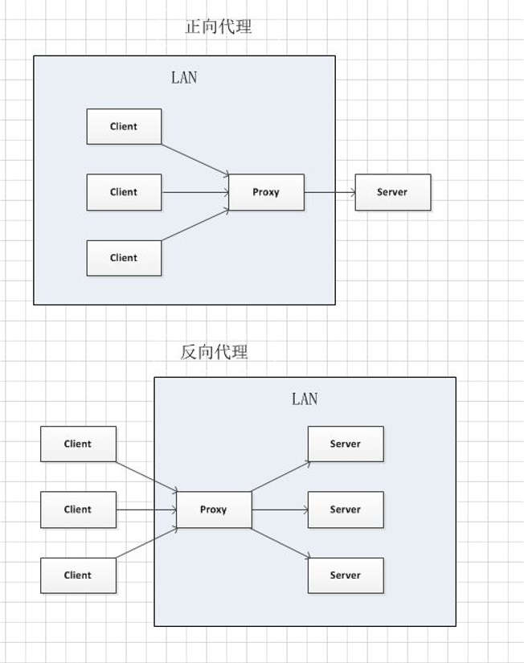

正向代理和反向代理的结构是一样的，都是 client-proxy-server 的结构，它们**主要的区别**就在于中间这个 proxy 是哪一方设置的。在正向代理中，proxy 是 client 设置的，用来隐藏 client；而在反向代理中，proxy 是 server 设置的，用来隐藏 server。


## 4. Nginx 的概念及其工作原理

Nginx 是一款轻量级的 Web 服务器，也可以用于反向代理、负载平衡和 HTTP 缓存等。Nginx 使用异步事件驱动的方法来处理请求，是一款面向性能设计的 HTTP 服务器。


传统的 Web 服务器如 Apache 是 process-based 模型的，而 Nginx 是基于event-driven模型的。正是这个主要的区别带给了 Nginx 在性能上的优势。


Nginx 架构的最顶层是一个 master process，这个 master process 用于产生其他的 worker process，这一点和Apache 非常像，但是 Nginx 的 worker process 可以同时处理大量的HTTP请求，而每个 Apache process 只能处理一个。


# 八、浏览器事件机制

## 1. 事件是什么？事件模型？

**事件是用户操作网页时发生的交互动作**，比如 click/move， 事件除了用户触发的动作外，还可以是文档加载，窗口滚动和大小调整。事件被封装成一个 event 对象，包含了该事件发生时的所有相关信息（ event 的属性）以及可以对事件进行的操作（ event 的方法）。


事件是用户操作网页时发生的交互动作或者网页本身的一些操作，现代浏览器一共有三种事件模型：

- **DOM0 级事件模型**，这种模型不会传播，所以没有事件流的概念，但是现在有的浏览器支持以冒泡的方式实现，它可以在网页中直接定义监听函数，也可以通过 js 属性来指定监听函数。所有浏览器都兼容这种方式。**直接在 dom 对象上注册事件名称，就是DOM0写法**。
- **IE 事件模型**，在该事件模型中，<u>一次事件共有两个过程，事件处理阶段和事件冒泡阶段</u>。事件处理阶段会首先执行目标元素绑定的监听事件。然后是事件冒泡阶段，冒泡指的是事件从目标元素冒泡到 document，依次检查经过的节点是否绑定了事件监听函数，如果有则执行。这种模型通过 attachEvent 来添加监听函数，可以添加多个监听函数，会按顺序依次执行。
- **DOM2 级事件模型**，在该事件模型中，一次事件共有<u>三个过程</u>，第一个过程是事件捕获阶段。捕获指的是事件从 document 一直向下传播到目标元素，依次检查经过的节点是否绑定了事件监听函数，如果有则执行。后面两个阶段和 IE 事件模型的两个阶段相同。这种事件模型，事件绑定的函数是 addEventListener，**其中第三个参数可以指定事件是否在捕获阶段执行，true 为捕获阶段**。


## 2. 如何阻止事件冒泡和默认事件

- 普通浏览器：event.stopPropagation() 和 event.preventDefault()
- IE 浏览器：event.cancelBubble = true 和 event.returnValue = false


## 3. 对事件委托的理解

### 概念

事件委托的**本质**上利用了**浏览器事件冒泡**的机制。因为事件在冒泡过程中会上传到父节点，父节点可以通过事件对象获取到目标节点，因此可以把子节点的监听函数定义在父节点上，<u>由父节点的监听函数统一处理多个子元素的事件，这种方式称为事件委托</u>（**事件代理**）。

使用事件委托可以不必要为每一个子元素都绑定一个监听事件，这样**减少了内存上的消耗**。并且使用事件代理还可以**实现事件的动态绑定**，比如说新增了一个子节点，并不需要单独地为它添加一个监听事件，它绑定的事件会交给父元素中的监听函数来处理。


### 事件委托的特点

1. 减少内存消耗，提高性能
   1. 避免给每一个子元素添加监听函数，反而把监听函数绑定到父元素上，减少大量的内存消耗，提升性能
2. 动态绑定事件
   1. 若新增/删除子元素，那么每次都需要给新增元素绑定/解绑事件，重复不必要的工作，但如果事件是绑定在父元素上，只要绑定一次就好了。


### 局限性

当然，事件委托也是有局限的。比如 focus、blur 之类的事件**没有**事件冒泡机制，所以无法实现事件委托；mousemove、mouseout 这样的事件，虽然有事件冒泡，但是只能不断通过位置去计算定位，**对性能消耗高**，因此也是不适合于事件委托的。


当然事件委托不是只有优点，它也是有**缺点**的，事件委托会影响页面性能，主要影响因素有：

- 元素中，绑定事件委托的次数；
- 点击的最底层元素，到绑定事件元素之间的`DOM`层数；


在必须使用事件委托的地方，可以进行如下的处理：

- 只在必须的地方，使用事件委托，比如：`ajax`的局部刷新区域
- 尽量的减少绑定的层级，不在`body`元素上，进行绑定
- 减少绑定的次数，如果可以，那么把多个事件的绑定，合并到一次事件委托中去，由这个事件委托的回调，来进行分发。


## 4. 同步和异步的区别

- 首先 JS 是单线程语言，同步会阻塞代码执行，异步不会阻塞代码执行
- **同步**指的是当一个进程在执行某个请求时，如果这个请求需要等待一段时间才能返回，那么这个进程会一直等待下去，直到消息返回为止再继续向下执行。
- **异步**指的是当一个进程在执行某个请求时，如果这个请求需要等待一段时间才能返回，这个时候进程会继续往下执行，<u>不会阻塞</u>等待消息的返回，当消息返回时系统再通知进程进行处理。


## 5. 对事件循环的理解

**事件循环机制**就是 js 作为一门单线程语言去执行各种任务时候<u>根据最优的规则</u>将任务分优先级依次递归去执行 js 任务(代码)。

具体讲：

因为 js 是单线程运行的，在代码执行时，通过将不同函数的执行上下文压入执行栈中来保证代码的有序执行。在执行同步代码时，如果遇到异步事件，js 引擎并不会一直等待其返回结果，而是会将这个<u>事件挂起</u>，继续执行执行栈中的其他任务。当异步事件执行完毕后，再将异步事件对应的回调加入到一个任务队列中等待执行。<u>任务队列可以分为宏任务队列和微任务队列</u>，当当前执行栈中的事件执行完毕后，js 引擎首先会判断微任务队列中是否有任务可以执行，如果有就将微任务队首的事件压入栈中执行。当微任务队列中的任务都执行完成后再去执行宏任务队列中的任务。

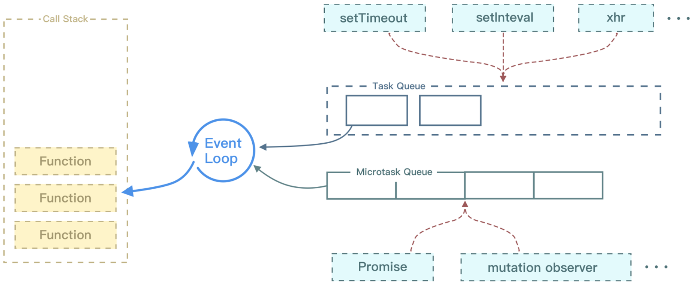

Event Loop 执行顺序如下所示：

- 首先执行同步代码，这属于宏任务
- 当执行完所有同步代码后，执行栈为空，查询是否有异步代码需要执行
- 执行所有微任务
- 当执行完所有微任务后，如有必要会渲染页面
- 然后开始下一轮 Event Loop，执行宏任务中的异步代码


## 6. 宏任务和微任务分别有哪些

在事件循环中，每进行一次循环操作称为 tick，tick 的任务处理模型是比较复杂的，里边有两个词：分别是 <u>Macro Task （宏任务）和 Micro Task（微任务）</u>。

- 宏任务：setTimeout、setInterval、script(整体代码)、I/O、UI 交互事件、setImmediate(Node.js 环境)
- 微任务：Promise 的回调、对 DOM 变化监听的 MutaionObserver、process.nextTick(Node.js 环境)


## 7. 什么是执行栈

执行栈，也叫调用栈，具有 LIFO（后进先出）结构，用于存储在代码执行期间创建的所有执行上下文。

> 当`Javascript`引擎开始执行你第一行脚本代码的时候，它就会创建一个全局执行上下文然后将它压到执行栈中
>
> 每当引擎碰到一个函数的时候，它就会创建一个函数执行上下文，然后将这个执行上下文压到执行栈中
>
> 引擎会执行位于执行栈栈顶的执行上下文(一般是函数执行上下文)，当该函数执行结束后，对应的执行上下文就会被弹出，然后控制流程到达执行栈的下一个执行上下文


## 8. Node 中的 Event Loop 和浏览器中的有什么区别？process.nextTick 执行顺序？

Node 中的 Event Loop 和浏览器中的是完全不相同的东西。Node.js采用V8作为js的解析引擎，而I/O处理方面使用了自己设计的libuv，libuv是一个基于事件驱动的跨平台抽象层，封装了不同操作系统一些底层特性，对外提供统一的API，事件循环机制也是它里面的实现。

**Node.js的运行机制如下:**

- V8 引擎解析 JavaScript 脚本。
- 解析后的代码，调用 Node API。
- libuv 库负责 Node API 的执行。它将不同的任务分配给不同的线程，形成一个 Event Loop（事件循环），以异步的方式将任务的执行结果返回给 V8 引擎。
- V8 引擎再将结果返回给用户。


### 六个阶段

其中 libuv 引擎中的事件循环分为 6 个阶段，它们会按照顺序反复运行。每当进入某一个阶段的时候，都会从对应的回调队列中取出函数去执行。当队列为空或者执行的回调函数数量到达系统设定的阈值，就会进入下一阶段。


从上图中，大致看出node中的事件循环的顺序：

外部输入数据-->轮询阶段(poll)-->检查阶段(check)-->关闭事件回调阶段(close callback)-->定时器检测阶段(timer)-->I/O事件回调阶段(I/O callbacks)-->闲置阶段(idle, prepare)-->轮询阶段（按照该顺序反复运行）...

- timers 阶段：这个阶段执行timer（setTimeout、setInterval）的回调
- I/O callbacks 阶段：处理一些上一轮循环中的少数未执行的 I/O 回调
- idle, prepare 阶段：仅node内部使用
- poll 阶段：获取新的I/O事件, 适当的条件下node将阻塞在这里
- check 阶段：执行 setImmediate() 的回调
- close callbacks 阶段：执行 socket 的 close 事件回调

注意：**上面六个阶段都不包括 process.nextTick()**

接下去我们详细介绍`timers`、`poll`、`check`这3个阶段，因为日常开发中的绝大部分异步任务都是在这3个阶段处理的。

（1）**Timers（计时器阶段）**：初次进入事件循环，会从计时器阶段开始。此阶段会判断是否存在过期的计时器回调（包含 setTimeout 和 setInterval），如果存在则会执行所有过期的计时器回调，执行完毕后，如果回调中触发了相应的微任务，会接着执行所有微任务，执行完微任务后再进入 Pending callbacks 阶段。

（2）**Pending callbacks**：执行推迟到下一个循环迭代的I / O回调（系统调用相关的回调）。

（3）**Idle/Prepare**：仅供内部使用。

（4）**Poll（轮询阶段）**：

- 当回调队列不为空时：会执行回调，若回调中触发了相应的微任务，这里的微任务执行时机和其他地方有所不同，不会等到所有回调执行完毕后才执行，而是针对每一个回调执行完毕后，就执行相应微任务。执行完所有的回调后，变为下面的情况。
- 当回调队列为空时（没有回调或所有回调执行完毕）：但如果存在有计时器（setTimeout、setInterval和setImmediate）没有执行，会结束轮询阶段，进入 Check 阶段。否则会阻塞并等待任何正在执行的I/O操作完成，并马上执行相应的回调，直到所有回调执行完毕。

（5）**Check（查询阶段）**：会检查是否存在 setImmediate 相关的回调，如果存在则执行所有回调，执行完毕后，如果回调中触发了相应的微任务，会接着执行所有微任务，执行完微任务后再进入 Close callbacks 阶段。

（6）**Close callbacks**：执行一些关闭回调，比如socket.on('close', ...)等。


下面来看一个例子，首先在有些情况下，定时器的执行顺序其实是**随机**的

```
setTimeout(() => {
    console.log('setTimeout')
}, 0)
setImmediate(() => {
    console.log('setImmediate')
})
```

对于以上代码来说，`setTimeout` 可能执行在前，也可能执行在后

- 首先 `setTimeout(fn, 0) === setTimeout(fn, 1)`，这是由源码决定的
- 进入事件循环也是需要成本的，如果在准备时候花费了大于 1ms 的时间，那么在 timer 阶段就会直接执行 `setTimeout` 回调
- 那么如果准备时间花费小于 1ms，那么就是 `setImmediate` 回调先执行了

当然在某些情况下，他们的执行顺序一定是固定的，比如以下代码：

```js
const fs = require('fs')
fs.readFile(__filename, () => {
    setTimeout(() => {
        console.log('timeout');
    }, 0)
    setImmediate(() => {
        console.log('immediate')
    })
})
```

在上述代码中，`setImmediate` 永远**先执行**。因为两个代码写在 IO 回调中，IO 回调是在 poll 阶段执行，当回调执行完毕后队列为空，发现存在 `setImmediate` 回调，所以就直接跳转到 check 阶段去执行回调了。


上面都是 macrotask 的执行情况，对于 microtask 来说，它会在以上每个阶段完成前**清空** microtask 队列，下图中的 Tick 就代表了 microtask

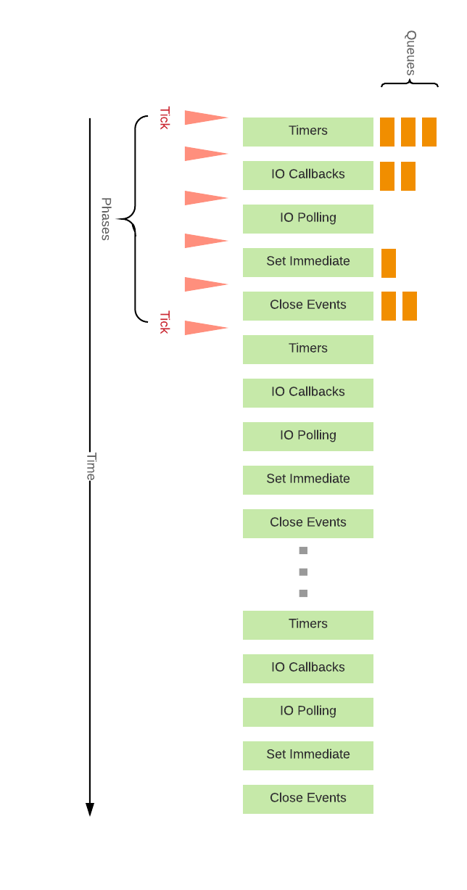

```js
setTimeout(() => {
  console.log('timer21')
}, 0)
Promise.resolve().then(function() {
  console.log('promise1')
})
```

对于以上代码来说，其实和浏览器中的输出是一样的，microtask 永远执行在 macrotask 前面。


最后来看 Node 中的 `process.nextTick`，这个函数其实是独立于 Event Loop 之外的，它有一个自己的队列，当每个阶段完成后，如果存在 nextTick 队列，就会**清空队列中的所有回调函数**，并且优先于其他 microtask 执行。

```js
setTimeout(() => {
 console.log('timer1')
 Promise.resolve().then(function() {
   console.log('promise1')
 })
}, 0)
process.nextTick(() => {
 console.log('nextTick')
 process.nextTick(() => {
   console.log('nextTick')
   process.nextTick(() => {
     console.log('nextTick')
     process.nextTick(() => {
       console.log('nextTick')
     })
   })
 })
})
```

对于以上代码，永远都是先把 nextTick 全部打印出来。


## 9. 事件触发的过程是怎样的

JS中事件执行的整个过程称之为事件流，分为三个阶段：事件捕获阶段，事件目标处理函数，事件冒泡。

如果同时注册`冒泡`与`捕获`,事件触发按照注册事件的顺序执行。


# 九、浏览器垃圾回收机制

## 1. V8 的垃圾回收机制是怎样的

V8将堆分为新生代和老生代两部分。

(1) 新生代算法

在新生代中的对象一般存活时间较短，使用Scavenge GC算法。在新生代空间中，内存空间分为两部分，分别为From空间和To空间。在这两个空间中，必定有一个空间是使用，一个空间是空闲的。新分配的对象会被放入From空间中，当From空间快被占满时，新生代GC就会启动。算法会检查From空间中存活的对象并复制到To空间中，如果有失活的对象就会被销毁。当复制完成后将From和To空间互换，这样GC就结束了。

(2) 老生代算法

​	老生代中的对象一般存活时间较长且数量也多。使用了两个算法，分别是标记清除和标记压缩算法。什么情况下对象会出现在老生代空间中:

- 新生代中的对象是否已经经历过一次Scavenge算法，如果经历过的话，会将对象从新生代空间中移到老生代空间中

- To空间的对象占比大小超过25%,在这种情况下，为了不影响到内存分配，会将对象从新生空间中移到老生代空间

在老生代中，以下情况会先启动标记清除算法:

- 某一个空间没有分块的时候 

- 空间中的对象超过一定的限制

- 空间不能保证新生代的对象移到老空间

​	在这个阶段中，会遍历堆中所有的对象，然后标记存活的对象，在标记完成后，销毁所有没有被标记的对象。在标记大型堆内存时，可能需要几百毫秒才能完成一次标记。为了解决这个问题，V8从stop-the-world标记切换到增量标记。在增量标记期间，GC将标记工作分解为更小的模块，可以让JS应用逻辑在模块间隙执行一会，从而不至于让应用出现停顿的情况。后续又有GC又推出并发标记，该技术可以让GC扫描和标记对象时，同时允许JS运行。

​	清除对象后会造成堆内存出现碎片的情况，当碎片超过一定限制后会启动压缩算法。在压缩过程中，将活的对象一端移动，直到所有对象都移动完成然后清理掉不需要的内存。

下面两个是JS的垃圾回收机制:

① 标记清除:给每一块内存空间打上标记，然后去除环境中被引用的变量的标记，加上标记的变量就是要被清除的变量。

② 引用计数(IE)：变量每次被引用一次，就会+1,解引用就-1。当引用计数为0时就清除，但是这种不利于循环引用。


## 2. 哪些操作会造成内存泄漏？

内存泄漏（Memory leak）是在计算机科学中，**由于疏忽或错误造成程序未能释放已经不再使用的内存**。

> 并非指内存在物理上的消失，而是应用程序分配某段内存后，由于设计错误，导致在释放该段内存之前就失去了对该段内存的控制，从而造成了内存的浪费。
>
> 对于持续运行的服务进程，必须及时释放不再用到的内存。否则，内存占用越来越高，轻则影响系统性能，重则导致进程崩溃。

- 第一种情况（**意外的全局变量**）是由于使用未声明的变量，而意外的创建了一个全局变量，而使这个变量一直留在内存中无法被回收。
- 第二种情况（**被遗忘的计时器或回调函数**）是设置了 setInterval 定时器，而忘记取消它，如果循环函数有对外部变量的引用的话，那么这个变量会被一直留在内存中，而无法被回收。
- 第三种情况（**脱离 DOM 的引用**）是获取一个 DOM 元素的引用，而后面这个元素被删除，由于我们一直保留了对这个元素的引用，所以它也无法被回收。
- 第四种情况（**闭包**）是不合理的使用闭包，从而导致某些变量一直被留在内存当中。

## 3. 减少垃圾回收

虽然浏览器可以进行垃圾自动回收，但是当代码比较复杂时，垃圾回收所带来的代价比较大，所以应该尽量减少垃圾回收。

- **对数组进行优化：**在清空一个数组时，最简单的方法就是给其赋值为[ ]，但是与此同时会创建一个新的空对象，**可以将数组的长度设置为0，以此来达到清空数组的目的**。
- **对`object`进行优化：**对象尽量复用，对于不再使用的对象，就将其设置为 null，尽快被回收。
- **对函数进行优化：**在循环中的函数表达式，如果可以复用，尽量放在函数的外面。

